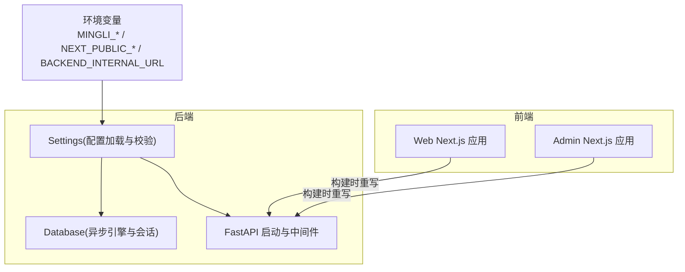
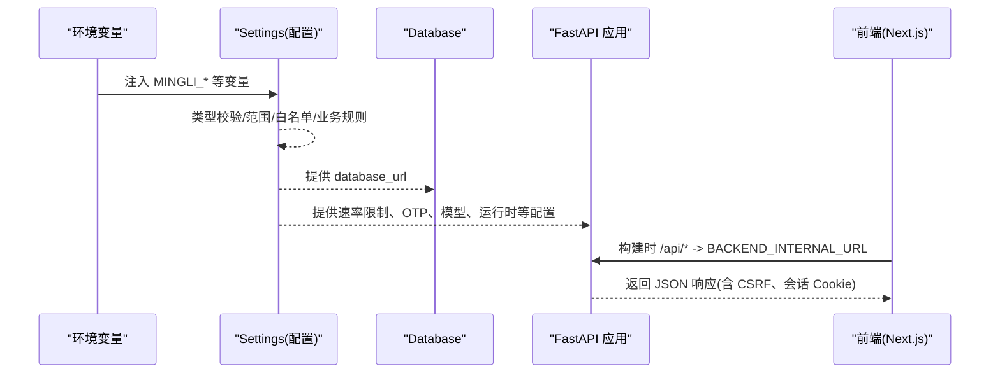
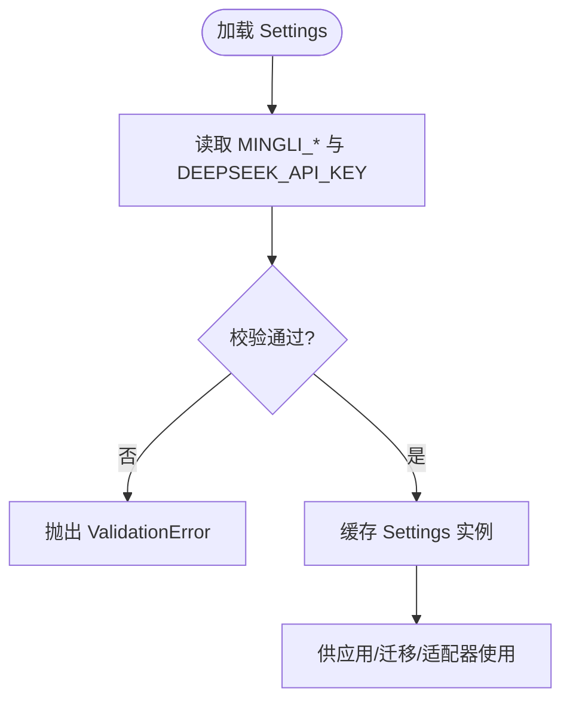
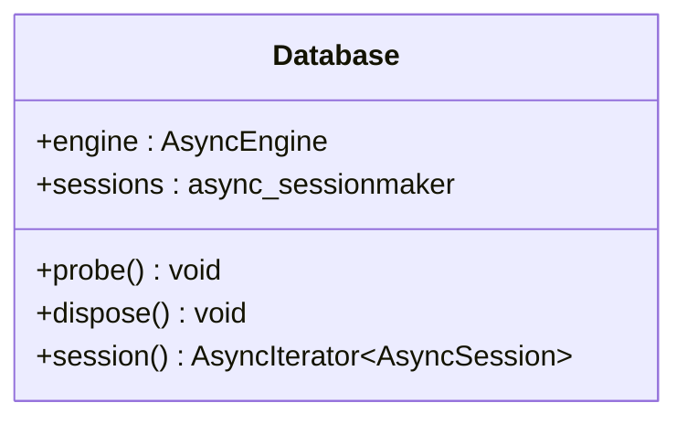
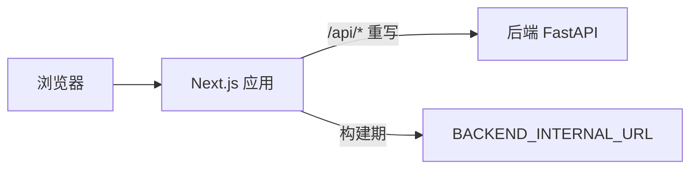
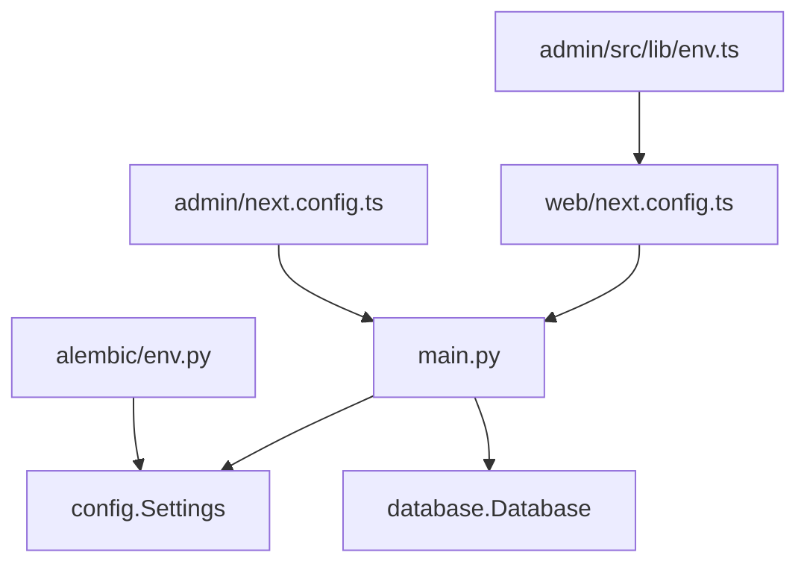

# 环境配置

<cite>
**本文引用的文件**
- [backend/app/config.py](file://backend/app/config.py)
- [backend/app/database.py](file://backend/app/database.py)
- [backend/alembic/env.py](file://backend/alembic/env.py)
- [infra/fateradar-test.env.example](file://infra/fateradar-test.env.example)
- [web/next.config.ts](file://web/next.config.ts)
- [admin/next.config.ts](file://admin/next.config.ts)
- [admin/src/lib/env.ts](file://admin/src/lib/env.ts)
- [backend/app/main.py](file://backend/app/main.py)
- [backend/tests/test_config.py](file://backend/tests/test_config.py)
- [scripts/check_production_secrets.py](file://scripts/check_production_secrets.py)
</cite>

## 目录
1. [简介](#简介)
2. [项目结构](#项目结构)
3. [核心组件](#核心组件)
4. [架构总览](#架构总览)
5. [详细组件分析](#详细组件分析)
6. [依赖关系分析](#依赖关系分析)
7. [性能与可靠性考虑](#性能与可靠性考虑)
8. [故障排查指南](#故障排查指南)
9. [结论](#结论)
10. [附录：环境变量清单与示例](#附录环境变量清单与示例)

## 简介
本指南聚焦于项目的“环境配置”主题，覆盖后端与前端的环境变量结构、数据库连接、Redis（当前未使用）、第三方服务密钥（如 DeepSeek）和应用程序设置；说明开发、测试、预发与生产环境的差异；给出敏感信息管理策略（密钥存储、加密传输、访问控制）；解释前后端环境变量的同步机制；提供配置验证与默认值处理；并给出配置变更管理流程、版本控制策略以及热重载与环境切换的最佳实践。

## 项目结构
本项目采用多模块结构：
- 后端 FastAPI 应用通过 Pydantic Settings 集中加载 MINGLI_ 前缀的环境变量，并进行严格的运行时校验与安全约束。
- 数据库连接由 SQLAlchemy AsyncEngine 管理，迁移脚本从同一 Settings 读取数据库 URL。
- 前端 Next.js 应用通过构建期环境变量注入后端地址，并通过统一的 API 客户端调用后端接口。
- 运维侧提供测试环境的环境变量示例文件，便于本地或单主机部署。

**图表来源**
- [backend/app/config.py:62-149](file://backend/app/config.py#L62-L149)
- [backend/app/database.py:12-33](file://backend/app/database.py#L12-L33)
- [web/next.config.ts:1-66](file://web/next.config.ts#L1-L66)
- [admin/next.config.ts:1-65](file://admin/next.config.ts#L1-L65)

**章节来源**
- [backend/app/config.py:62-149](file://backend/app/config.py#L62-L149)
- [backend/app/database.py:12-33](file://backend/app/database.py#L12-L33)
- [web/next.config.ts:1-66](file://web/next.config.ts#L1-L66)
- [admin/next.config.ts:1-65](file://admin/next.config.ts#L1-L65)

## 核心组件
- 统一配置模型：基于 Pydantic Settings，所有后端配置以 MINGLI_ 为前缀的环境变量注入，并提供类型校验、范围限制、白名单与业务规则检查。
- 数据库连接：通过 Settings.database_url 创建异步引擎，支持健康探测与资源释放。
- 迁移系统：Alembic 在离线/在线模式下均从 Settings 获取数据库 URL，保证迁移与运行一致。
- 前端代理：Next.js 构建时将 /api/* 重写至 BACKEND_INTERNAL_URL，避免跨域问题。
- 安全与日志：请求级观察性中间件记录结构化日志，屏蔽敏感传输层日志。

**章节来源**
- [backend/app/config.py:62-149](file://backend/app/config.py#L62-L149)
- [backend/app/database.py:12-33](file://backend/app/database.py#L12-L33)
- [backend/alembic/env.py:20-58](file://backend/alembic/env.py#L20-L58)
- [web/next.config.ts:27-62](file://web/next.config.ts#L27-L62)
- [admin/next.config.ts:27-62](file://admin/next.config.ts#L27-L62)
- [backend/app/observability.py:14-52](file://backend/app/observability.py#L14-L52)

## 架构总览
下图展示了配置加载、校验、应用启动与前端代理的端到端流程。

**图表来源**
- [backend/app/config.py:62-149](file://backend/app/config.py#L62-L149)
- [backend/app/database.py:12-33](file://backend/app/database.py#L12-L33)
- [web/next.config.ts:27-62](file://web/next.config.ts#L27-L62)
- [admin/next.config.ts:27-62](file://admin/next.config.ts#L27-L62)

## 详细组件分析

### 配置加载与校验（Settings）
- 环境变量前缀：MINGLI_，大小写不敏感，忽略多余字段。
- 关键配置项：
  - 环境与 Cookie：environment、cookie_secure、cookie_domain。
  - 数据库：database_url。
  - OTP：otp_adapter、smtp_*、fake_otp_code、各类窗口限流参数。
  - 运行时：runtime_adapter、路径、超时、最大输入输出字节、期望的 manifest/capability 摘要。
  - 模型：model_adapter、deepseek_api_key、超时、温度、最大输出 token、价格快照与货币。
  - 身份与内容加密：identity_hash_key、content_encryption_key_b64、content_encryption_key_id。
  - 其他：trusted_proxy_cidrs、session 时长、管理员引导账号、日志级别、真实流量开关等。
- 校验与约束：
  - 生产环境强制 secure cookie、禁止 fake OTP/runtime/model、要求固定路径与冻结摘要、禁止本地密钥、真实流量需告警接收器且默认关闭。
  - SMTP 模式必须补齐 host/username/password/sender。
  - 内容加密密钥必须是合法 base64 且解码为 32 字节，不得复用 identity hash key。
  - 模型相关参数有严格上限与白名单限制。
- 特殊处理：
  - DEEPSEEK_API_KEY 单独从环境变量读取，并在非 deepseek 场景下从日志中剔除，防止泄露。
  - 提供 get_settings() 缓存实例，减少重复解析。

**图表来源**
- [backend/app/config.py:62-149](file://backend/app/config.py#L62-L149)
- [backend/app/config.py:150-186](file://backend/app/config.py#L150-L186)
- [backend/app/config.py:188-329](file://backend/app/config.py#L188-L329)
- [backend/app/config.py:332-335](file://backend/app/config.py#L332-L335)

**章节来源**
- [backend/app/config.py:62-149](file://backend/app/config.py#L62-L149)
- [backend/app/config.py:150-186](file://backend/app/config.py#L150-L186)
- [backend/app/config.py:188-329](file://backend/app/config.py#L188-L329)
- [backend/tests/test_config.py:12-191](file://backend/tests/test_config.py#L12-L191)

### 数据库连接与迁移
- 连接管理：Database 类封装异步引擎与会话工厂，提供 probe/dispose/session 方法。
- 迁移：Alembic 在离线/在线模式下均从 Settings().database_url 获取连接字符串，确保迁移与运行一致性。

**图表来源**
- [backend/app/database.py:12-33](file://backend/app/database.py#L12-L33)
- [backend/alembic/env.py:20-58](file://backend/alembic/env.py#L20-L58)

**章节来源**
- [backend/app/database.py:12-33](file://backend/app/database.py#L12-L33)
- [backend/alembic/env.py:20-58](file://backend/alembic/env.py#L20-L58)

### 前端代理与构建期配置
- Web/Admin 应用通过 next.config.ts 将 /api/* 重写至 BACKEND_INTERNAL_URL，实现构建期绑定后端地址。
- 安全头：CSP、Referrer-Policy、Permissions-Policy、X-Content-Type-Options、X-Frame-Options、COOP 等。
- 私有页面：/app 与 /account 路径添加 no-store 等缓存控制头。

**图表来源**
- [web/next.config.ts:1-66](file://web/next.config.ts#L1-L66)
- [admin/next.config.ts:1-65](file://admin/next.config.ts#L1-L65)

**章节来源**
- [web/next.config.ts:1-66](file://web/next.config.ts#L1-L66)
- [admin/next.config.ts:1-65](file://admin/next.config.ts#L1-L65)

### 环境变量同步机制（前后端）
- 后端：全部通过 MINGLI_ 前缀的环境变量注入，并由 Settings 集中校验。
- 前端：
  - 构建期：NEXT_PUBLIC_MINGLI_ENV 用于标识部署环境（local/test/staging/production），仅用于 UI 展示与逻辑分支。
  - 构建期：BACKEND_INTERNAL_URL 决定 API 目标地址，无需运行时暴露给浏览器。
- 建议：保持前后端 environment 取值一致（local/test/staging/production），以便统一行为与观测。

**章节来源**
- [admin/src/lib/env.ts:1-10](file://admin/src/lib/env.ts#L1-L10)
- [web/next.config.ts:1-66](file://web/next.config.ts#L1-L66)
- [admin/next.config.ts:1-65](file://admin/next.config.ts#L1-L65)

### 不同环境的配置差异
- local/test：
  - 默认 environment=local，允许 fake OTP/runtime/model，Cookie 可非 Secure。
  - 可使用示例 env 文件快速启动。
- staging：
  - 更接近生产，但仍可使用非生产适配器；SMTP 需要完整凭据。
- production：
  - 强制 secure cookie、禁用 fake 适配器、要求固定路径与冻结摘要、禁止本地密钥、真实流量默认关闭且需告警接收器。
  - 模型提供商与端点受白名单限制，DeepSeek 密钥必须注入。

**章节来源**
- [backend/app/config.py:188-329](file://backend/app/config.py#L188-L329)
- [infra/fateradar-test.env.example:13-45](file://infra/fateradar-test.env.example#L13-L45)
- [backend/tests/test_config.py:12-191](file://backend/tests/test_config.py#L12-L191)

### 敏感信息安全管理
- 密钥存储：
  - 通过环境变量注入，不在代码中硬编码；DEEPSEEK_API_KEY 单独读取并从日志中剔除。
  - 内容加密密钥与身份哈希密钥不得复用，生产环境必须替换为外部注入的真实密钥。
- 加密传输：
  - 生产环境强制 secure cookie；前端启用 CSP、Referrer-Policy、Permissions-Policy 等安全头。
- 访问控制：
  - trusted_proxy_cidrs 限制可信代理网络；管理员引导凭据在生产被禁止。
- 检查工具：
  - scripts/check_production_secrets.py 用于在部署前校验生产密钥存在性与合法性。

**章节来源**
- [backend/app/config.py:150-186](file://backend/app/config.py#L150-L186)
- [backend/app/config.py:188-329](file://backend/app/config.py#L188-L329)
- [web/next.config.ts:27-62](file://web/next.config.ts#L27-L62)
- [admin/next.config.ts:27-62](file://admin/next.config.ts#L27-L62)
- [scripts/check_production_secrets.py:1-57](file://scripts/check_production_secrets.py#L1-L57)

### 配置变更管理与版本控制
- 变更原则：
  - 新增或修改环境变量需在 Settings 中声明默认值与校验规则，避免运行时错误。
  - 生产环境的关键路径与摘要必须冻结，禁止随意更改。
- 版本控制：
  - 环境变量示例文件置于 infra/ 下，作为参考模板；实际密钥不应入库。
  - 迁移脚本与配置强耦合，确保数据库结构与运行配置一致。
- 发布流程：
  - 使用 check_production_secrets.py 在部署前进行密钥完整性与格式校验。
  - 通过 CI/CD 注入密钥到运行环境，避免进入代码仓库。

**章节来源**
- [backend/app/config.py:62-149](file://backend/app/config.py#L62-L149)
- [backend/app/config.py:188-329](file://backend/app/config.py#L188-L329)
- [infra/fateradar-test.env.example:1-45](file://infra/fateradar-test.env.example#L1-L45)
- [scripts/check_production_secrets.py:1-57](file://scripts/check_production_secrets.py#L1-L57)

### 配置热重载与环境切换最佳实践
- 热重载：
  - 当前 Settings 使用 lru_cache 缓存实例，重启进程即可加载新配置；不建议在运行中动态热重载。
  - 若确需热重载，应显式清除缓存并重建 Settings 实例。
- 环境切换：
  - 通过切换环境变量（如 MINGLI_ENVIRONMENT）实现；确保前后端 environment 一致。
  - 前端通过构建期 BACKEND_INTERNAL_URL 指向对应后端，避免运行时切换风险。
- 推荐实践：
  - 每个环境独立维护环境变量文件（或密钥管理服务），最小权限注入。
  - 使用容器编排或 systemd 单元文件隔离环境配置。

**章节来源**
- [backend/app/config.py:332-335](file://backend/app/config.py#L332-L335)
- [web/next.config.ts:1-66](file://web/next.config.ts#L1-L66)
- [admin/next.config.ts:1-65](file://admin/next.config.ts#L1-L65)

## 依赖关系分析
- 后端内部依赖：
  - main.py 在启动时读取 Settings，初始化速率限制器、可信代理网络、OTP 投递适配器等。
  - database.py 提供数据库连接能力，供各模块使用。
  - alembic/env.py 依赖 Settings 获取数据库 URL 执行迁移。
- 前端依赖：
  - web/admin 的 next.config.ts 将 /api/* 重写至 BACKEND_INTERNAL_URL。
  - admin/src/lib/env.ts 读取 NEXT_PUBLIC_MINGLI_ENV 用于环境标识。

**图表来源**
- [backend/app/main.py:76-103](file://backend/app/main.py#L76-L103)
- [backend/app/config.py:62-149](file://backend/app/config.py#L62-L149)
- [backend/app/database.py:12-33](file://backend/app/database.py#L12-L33)
- [backend/alembic/env.py:20-58](file://backend/alembic/env.py#L20-L58)
- [web/next.config.ts:27-62](file://web/next.config.ts#L27-L62)
- [admin/next.config.ts:27-62](file://admin/next.config.ts#L27-L62)
- [admin/src/lib/env.ts:1-10](file://admin/src/lib/env.ts#L1-L10)

**章节来源**
- [backend/app/main.py:76-103](file://backend/app/main.py#L76-L103)
- [backend/app/config.py:62-149](file://backend/app/config.py#L62-L149)
- [backend/app/database.py:12-33](file://backend/app/database.py#L12-L33)
- [backend/alembic/env.py:20-58](file://backend/alembic/env.py#L20-L58)
- [web/next.config.ts:27-62](file://web/next.config.ts#L27-L62)
- [admin/next.config.ts:27-62](file://admin/next.config.ts#L27-L62)
- [admin/src/lib/env.ts:1-10](file://admin/src/lib/env.ts#L1-L10)

## 性能与可靠性考虑
- 连接池与健康检查：数据库引擎启用 pool_pre_ping，提升连接可用性。
- 超时与限流：模型连接/读取/总体超时、响应体大小、温度与输出 token 均有上限；读写操作具备速率限制。
- 日志与观测：结构化 HTTP 请求日志，屏蔽敏感传输层日志，便于追踪与排障。
- 安全头：CSP、Referrer-Policy、Permissions-Policy 等降低攻击面。

**章节来源**
- [backend/app/database.py:12-33](file://backend/app/database.py#L12-L33)
- [backend/app/config.py:101-149](file://backend/app/config.py#L101-L149)
- [backend/app/config.py:253-291](file://backend/app/config.py#L253-L291)
- [backend/app/observability.py:14-52](file://backend/app/observability.py#L14-L52)
- [web/next.config.ts:27-62](file://web/next.config.ts#L27-L62)
- [admin/next.config.ts:27-62](file://admin/next.config.ts#L27-L62)

## 故障排查指南
- 常见配置错误：
  - 生产环境缺少 secure cookie 或使用了 fake OTP/runtime/model。
  - SMTP 模式缺少必要凭据。
  - 内容加密密钥不是合法的 base64 或长度不为 32 字节。
  - 生产环境使用了本地默认密钥或路径。
- 定位方法：
  - 查看 Settings 校验抛出的 ValidationError 消息。
  - 使用 scripts/check_production_secrets.py 检查生产密钥是否注入且合法。
  - 检查前端构建时的 BACKEND_INTERNAL_URL 是否正确指向后端。
- 恢复步骤：
  - 修正环境变量后重启后端进程（Settings 缓存会失效）。
  - 重新构建前端以更新代理目标。

**章节来源**
- [backend/app/config.py:188-329](file://backend/app/config.py#L188-L329)
- [backend/tests/test_config.py:12-191](file://backend/tests/test_config.py#L12-L191)
- [scripts/check_production_secrets.py:1-57](file://scripts/check_production_secrets.py#L1-L57)
- [web/next.config.ts:27-62](file://web/next.config.ts#L27-L62)

## 结论
本项目通过集中化的 Settings 模型实现了严格的环境配置管理，结合构建期前端代理与安全头，确保了多环境的一致性与安全性。生产环境对密钥、路径、模型与流量控制施加了强约束，配合检查脚本与测试用例保障上线质量。建议在部署流水线中集成密钥注入与配置校验，遵循最小权限与冻结策略，确保稳定可靠的运行。

## 附录：环境变量清单与示例
- 后端（MINGLI_*）：
  - 基础：MINGLI_APP_NAME、MINGLI_ENVIRONMENT、MINGLI_LOG_LEVEL、MINGLI_TRUSTED_PROXY_CIDRS。
  - 数据库：MINGLI_DATABASE_URL。
  - Cookie：MINGLI_COOKIE_SECURE、MINGLI_COOKIE_DOMAIN。
  - OTP：MINGLI_OTP_ADAPTER、MINGLI_SMTP_*、MINGLI_FAKE_OTP_CODE、各类窗口限流参数。
  - 运行时：MINGLI_RUNTIME_ADAPTER、路径、超时、最大 I/O 字节、期望摘要。
  - 模型：MINGLI_MODEL_ADAPTER、MINGLI_DEEPSEEK_API_KEY（通过 DEEPSEEK_API_KEY 注入）、超时、温度、输出 token、价格快照与货币。
  - 身份与加密：MINGLI_IDENTITY_HASH_KEY、MINGLI_CONTENT_ENCRYPTION_KEY_B64、MINGLI_CONTENT_ENCRYPTION_KEY_ID。
  - 其他：MINGLI_DEVICE_SESSION_DAYS、MINGLI_ADMIN_SESSION_HOURS、MINGLI_ADMIN_BOOTSTRAP_*、MINGLI_REAL_TRAFFIC_ENABLED、MINGLI_ALERT_SINK_ENABLED。
- 前端（构建期）：
  - NEXT_PUBLIC_MINGLI_ENV：环境标识（local/test/staging/production）。
  - BACKEND_INTERNAL_URL：后端地址，用于 /api/* 重写。
- 示例：
  - infra/fateradar-test.env.example 提供了测试环境的占位示例，部署时需替换敏感值。

**章节来源**
- [backend/app/config.py:62-149](file://backend/app/config.py#L62-L149)
- [infra/fateradar-test.env.example:13-45](file://infra/fateradar-test.env.example#L13-L45)
- [web/next.config.ts:1-66](file://web/next.config.ts#L1-L66)
- [admin/next.config.ts:1-65](file://admin/next.config.ts#L1-L65)
- [admin/src/lib/env.ts:1-10](file://admin/src/lib/env.ts#L1-L10)