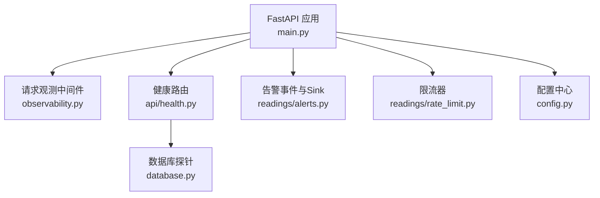
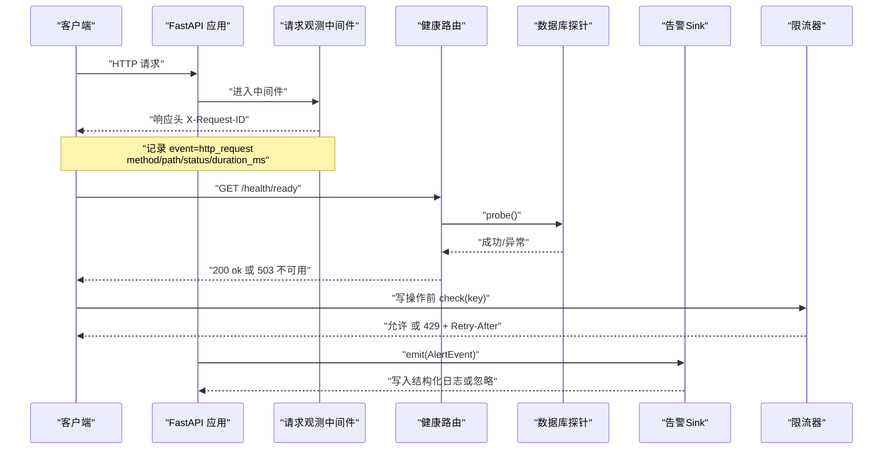
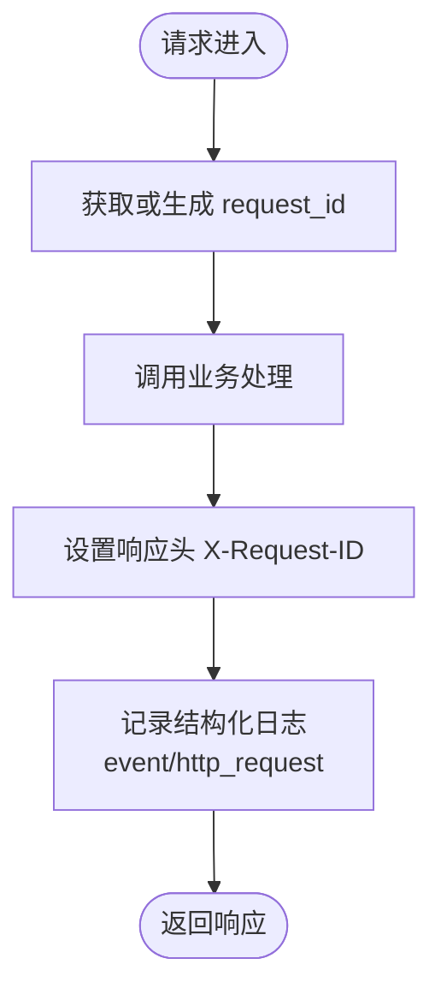
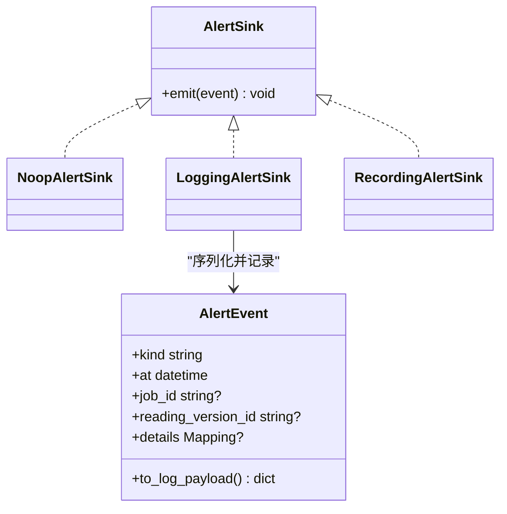
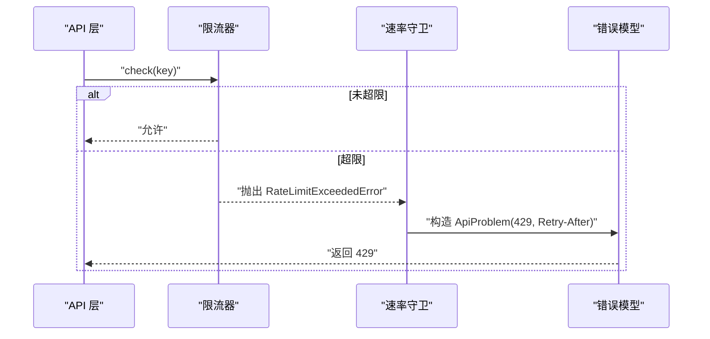
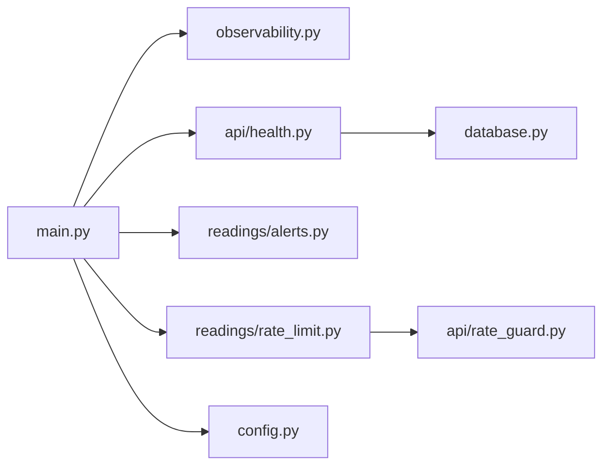

# 监控告警

<cite>
**本文引用的文件**
- [backend/app/observability.py](file://backend/app/observability.py)
- [backend/app/main.py](file://backend/app/main.py)
- [backend/app/config.py](file://backend/app/config.py)
- [backend/app/api/health.py](file://backend/app/api/health.py)
- [backend/app/database.py](file://backend/app/database.py)
- [backend/app/readings/alerts.py](file://backend/app/readings/alerts.py)
- [backend/app/readings/rate_limit.py](file://backend/app/readings/rate_limit.py)
- [backend/app/api/rate_guard.py](file://backend/app/api/rate_guard.py)
- [backend/app/api/errors.py](file://backend/app/api/errors.py)
- [contracts/schemas/health.schema.json](file://contracts/schemas/health.schema.json)
- [admin/src/app/audit/page.tsx](file://admin/src/app/audit/page.tsx)
</cite>

## 目录
1. [简介](#简介)
2. [项目结构](#项目结构)
3. [核心组件](#核心组件)
4. [架构总览](#架构总览)
5. [详细组件分析](#详细组件分析)
6. [依赖关系分析](#依赖关系分析)
7. [性能与容量规划](#性能与容量规划)
8. [故障排查指南](#故障排查指南)
9. [结论](#结论)
10. [附录](#附录)

## 简介
本文件面向运维、SRE 与后端开发者，系统化说明该项目的监控与告警能力现状与扩展点。内容覆盖：
- 应用级指标收集：HTTP 请求追踪、耗时统计、结构化日志
- 日志策略：统一格式、敏感信息屏蔽、可聚合查询
- 系统级监控：健康检查（存活/就绪）与数据库探针
- 告警机制：结构化告警事件、开关控制、可扩展的 Sink 抽象
- 容量规划与性能调优：限流、超时、资源水位与瓶颈定位
- 审计与合规：审计页面占位、运行时审计产物校验
- 可视化与报表：基于结构化日志的查询与报表方案建议

## 项目结构
本项目采用模块化单体架构，后端使用 FastAPI，前端包含管理端与用户端。监控与告警相关的关键位置如下：
- 应用启动与中间件：在应用生命周期中安装请求观测中间件、配置日志级别、注册路由与健康探针
- 健康检查：提供 /health/live 与 /health/ready 两个端点，后者通过数据库探针判断服务就绪
- 告警事件：定义统一的告警事件结构与多种 Sink（空实现、日志输出、测试记录）
- 限流：进程内滑动窗口限流器，用于写操作保护
- 配置：集中式 Settings，含日志级别、告警开关等关键参数

图表来源
- [backend/app/main.py:30-140](file://backend/app/main.py#L30-L140)
- [backend/app/observability.py:27-52](file://backend/app/observability.py#L27-L52)
- [backend/app/api/health.py:11-36](file://backend/app/api/health.py#L11-L36)
- [backend/app/database.py:23-28](file://backend/app/database.py#L23-L28)
- [backend/app/readings/alerts.py:16-75](file://backend/app/readings/alerts.py#L16-L75)
- [backend/app/readings/rate_limit.py:9-60](file://backend/app/readings/rate_limit.py#L9-L60)
- [backend/app/config.py:62-149](file://backend/app/config.py#L62-L149)

章节来源
- [backend/app/main.py:30-140](file://backend/app/main.py#L30-L140)
- [backend/app/config.py:62-149](file://backend/app/config.py#L62-L149)

## 核心组件
- 请求观测中间件：为每个 HTTP 请求生成或透传唯一请求 ID，记录方法、路径、状态码、耗时，并回写响应头便于链路追踪
- 健康检查：/health/live 返回 API 存活；/health/ready 调用数据库探针，失败时返回 503 并附带问题类型
- 告警事件：统一的事件模型，支持附加 job_id、reading_version_id、details；当前默认 Sink 将告警以结构化 JSON 写入日志
- 限流器：进程内滑动窗口限流，超限后抛出错误并由网关层转换为 429 与 Retry-After 头
- 配置项：log_level 控制日志级别；alert_sink_enabled 控制告警是否启用；其他与速率限制、模型、运行时相关的阈值也在此集中管理

章节来源
- [backend/app/observability.py:14-52](file://backend/app/observability.py#L14-L52)
- [backend/app/api/health.py:11-36](file://backend/app/api/health.py#L11-L36)
- [backend/app/readings/alerts.py:16-75](file://backend/app/readings/alerts.py#L16-L75)
- [backend/app/readings/rate_limit.py:9-60](file://backend/app/readings/rate_limit.py#L9-L60)
- [backend/app/api/rate_guard.py:5-19](file://backend/app/api/rate_guard.py#L5-L19)
- [backend/app/config.py:146-149](file://backend/app/config.py#L146-L149)

## 架构总览
下图展示从请求进入、观测、健康检查到告警事件的完整流程，以及限流对写操作的拦截。

图表来源
- [backend/app/observability.py:27-52](file://backend/app/observability.py#L27-L52)
- [backend/app/api/health.py:11-36](file://backend/app/api/health.py#L11-L36)
- [backend/app/database.py:23-28](file://backend/app/database.py#L23-L28)
- [backend/app/readings/alerts.py:16-75](file://backend/app/readings/alerts.py#L16-L75)
- [backend/app/readings/rate_limit.py:23-32](file://backend/app/readings/rate_limit.py#L23-L32)
- [backend/app/api/rate_guard.py:5-19](file://backend/app/api/rate_guard.py#L5-L19)

## 详细组件分析

### 应用级监控指标收集
- 请求级指标：中间件在每个请求上记录 method、path、status、duration_ms，并保证 request_id 一致性（优先使用请求头 x-request-id，否则生成）
- 日志格式：JSON 单行、键排序、无多余空白，便于日志系统解析与聚合
- 敏感信息：传输层日志源被降级至 WARNING，避免泄露敏感报文

图表来源
- [backend/app/observability.py:20-52](file://backend/app/observability.py#L20-L52)

章节来源
- [backend/app/observability.py:14-52](file://backend/app/observability.py#L14-L52)

### 日志收集与分析策略
- 结构化日志：所有告警与 HTTP 访问日志均为 JSON 对象，字段稳定、键有序，适合 ELK/Loki 等系统采集
- 日志级别：通过配置 log_level 控制全局日志级别；传输层日志源被设置为 WARNING
- 聚合与查询建议：
  - 按 event 字段过滤：http_request、ops_alert
  - 按 status、path、method 维度聚合 QPS、错误率、P95/P99 耗时
  - 按 request_id 进行全链路追踪
- 安全：避免在日志中输出密钥与敏感数据；告警事件仅包含必要上下文

章节来源
- [backend/app/observability.py:14-18](file://backend/app/observability.py#L14-L18)
- [backend/app/readings/alerts.py:28-59](file://backend/app/readings/alerts.py#L28-L59)
- [backend/app/config.py:146-149](file://backend/app/config.py#L146-L149)

### 系统级监控（CPU、内存、磁盘、网络）
- 健康检查：/health/live 表示进程存活；/health/ready 通过数据库探针验证依赖可用
- 外部指标：CPU、内存、磁盘、网络等系统级指标需由宿主或容器平台（如 Prometheus Node Exporter、云监控）采集，并通过统一看板呈现
- 建议：将健康检查与系统指标关联，当 /health/ready 失败时联动触发系统级告警

章节来源
- [backend/app/api/health.py:11-36](file://backend/app/api/health.py#L11-L36)
- [backend/app/database.py:23-28](file://backend/app/database.py#L23-L28)

### 告警规则配置
- 事件模型：AlertEvent 包含 kind、at、job_id、reading_version_id、details；to_log_payload 生成结构化日志负载
- Sink 实现：
  - NoopAlertSink：不输出（测试或禁用场景）
  - LoggingAlertSink：输出到日志（本地/预发环境）
  - RecordingAlertSink：内存记录（单元测试）
- 开关：alert_sink_enabled 控制告警是否启用；生产环境要求真实流量开启时必须启用告警 Sink
- 通知渠道与升级：当前仅日志输出；可在 AlertSink 协议之上扩展 Webhook、邮件、IM 等渠道，并实现分级与升级逻辑

图表来源
- [backend/app/readings/alerts.py:16-75](file://backend/app/readings/alerts.py#L16-L75)

章节来源
- [backend/app/readings/alerts.py:16-75](file://backend/app/readings/alerts.py#L16-L75)
- [backend/app/config.py:146-149](file://backend/app/config.py#L146-L149)
- [backend/app/config.py:321-328](file://backend/app/config.py#L321-L328)

### 限流与错误追踪
- 限流器：WindowRateLimiter 使用滑动窗口记录命中时间，超过限制则抛出 RateLimitExceededError，并在网关层转为 429 与 Retry-After
- 错误追踪：ApiProblem 统一错误模型，配合全局异常处理器输出一致的问题文档；结合 request_id 可快速定位问题

图表来源
- [backend/app/readings/rate_limit.py:23-32](file://backend/app/readings/rate_limit.py#L23-L32)
- [backend/app/api/rate_guard.py:5-19](file://backend/app/api/rate_guard.py#L5-L19)
- [backend/app/api/errors.py:1-17](file://backend/app/api/errors.py#L1-L17)

章节来源
- [backend/app/readings/rate_limit.py:9-60](file://backend/app/readings/rate_limit.py#L9-L60)
- [backend/app/api/rate_guard.py:5-19](file://backend/app/api/rate_guard.py#L5-L19)
- [backend/app/api/errors.py:1-17](file://backend/app/api/errors.py#L1-L17)

### 审计日志与合规性报告
- 管理端审计页面：当前为占位页，提示后续接入 audit-events API
- 运行时审计：镜像构建与发布流程中包含审计脚本与产物校验，确保命令清单、签名与策略符合预期
- 建议：在后端引入审计事件 Sink，将关键操作（登录、权限变更、数据导出）写入独立审计日志通道，并提供只读查询接口

章节来源
- [admin/src/app/audit/page.tsx:4-10](file://admin/src/app/audit/page.tsx#L4-L10)

### 监控数据的可视化与报表
- 指标来源：
  - 应用指标：HTTP 请求量、错误率、延迟分布（来自 observability 日志）
  - 告警事件：ops_alert 事件（来自 alerts 日志）
  - 健康状态：/health/live 与 /health/ready 结果
- 可视化建议：
  - 使用日志系统（ELK/Loki）建立仪表盘：QPS、错误率、P95/P99 耗时、告警趋势
  - 使用时序数据库（Prometheus）采集系统指标，并与应用指标关联
  - 报表：按日/周/月汇总错误率、告警数量、限流触发次数，形成运营报表

[本节为概念性说明，不直接分析具体代码文件]

## 依赖关系分析
- main.py 负责装配：注入 Settings、Database、Rate Limiter、OTP 适配器，安装日志与观测中间件，注册路由与健康探针
- health.py 依赖 database.probe 作为就绪探针
- alerts.py 提供告警事件与 Sink 抽象，当前默认输出到日志
- rate_limit.py 提供限流能力，rate_guard.py 将其暴露为 API 错误语义
- config.py 集中管理运行期参数，包括日志级别、告警开关、速率限制窗口等

图表来源
- [backend/app/main.py:30-140](file://backend/app/main.py#L30-L140)
- [backend/app/observability.py:27-52](file://backend/app/observability.py#L27-L52)
- [backend/app/api/health.py:11-36](file://backend/app/api/health.py#L11-L36)
- [backend/app/database.py:23-28](file://backend/app/database.py#L23-L28)
- [backend/app/readings/alerts.py:16-75](file://backend/app/readings/alerts.py#L16-L75)
- [backend/app/readings/rate_limit.py:9-60](file://backend/app/readings/rate_limit.py#L9-L60)
- [backend/app/api/rate_guard.py:5-19](file://backend/app/api/rate_guard.py#L5-L19)
- [backend/app/config.py:62-149](file://backend/app/config.py#L62-L149)

章节来源
- [backend/app/main.py:30-140](file://backend/app/main.py#L30-L140)
- [backend/app/config.py:62-149](file://backend/app/config.py#L62-L149)

## 性能与容量规划
- 限流策略：
  - 写操作限流：针对读取版本、个人资料、访客会话创建、管理员登录等关键写路径设置窗口与上限，防止雪崩
  - 重试引导：429 响应携带 Retry-After，客户端应遵循退避策略
- 超时与资源：
  - 模型调用与运行时执行存在连接、读取、整体超时限制，避免长尾阻塞
  - 输入/输出字节限制与 token 上限保障资源可控
- 容量规划建议：
  - 根据历史 QPS 与 P99 延迟设定实例数与水平扩容阈值
  - 数据库连接池与慢查询优化，关注 /health/ready 失败根因
  - 日志吞吐与存储容量评估，合理归档与保留策略

章节来源
- [backend/app/readings/rate_limit.py:9-60](file://backend/app/readings/rate_limit.py#L9-L60)
- [backend/app/api/rate_guard.py:5-19](file://backend/app/api/rate_guard.py#L5-L19)
- [backend/app/config.py:97-118](file://backend/app/config.py#L97-L118)
- [backend/app/config.py:253-274](file://backend/app/config.py#L253-L274)

## 故障排查指南
- 健康检查失败：
  - /health/ready 返回 503：检查数据库连通性与探针实现
  - 查看日志中的 dependency-unavailable 问题类型
- 限流触发：
  - 429 响应携带 Retry-After：确认客户端重试间隔与限流窗口配置
  - 检查 key 粒度是否过粗导致误伤
- 请求追踪：
  - 使用 X-Request-ID 串联上下游日志，定位慢请求与错误
- 告警事件：
  - 若 alert_sink_enabled 为 false，告警不会输出；生产环境开启真实流量时必须启用
  - 检查日志中的 ops_alert 事件，提取 kind、details 进行分析

章节来源
- [backend/app/api/health.py:18-34](file://backend/app/api/health.py#L18-L34)
- [backend/app/api/rate_guard.py:5-19](file://backend/app/api/rate_guard.py#L5-L19)
- [backend/app/observability.py:27-52](file://backend/app/observability.py#L27-L52)
- [backend/app/readings/alerts.py:48-59](file://backend/app/readings/alerts.py#L48-L59)
- [backend/app/config.py:321-328](file://backend/app/config.py#L321-L328)

## 结论
本项目已具备稳定的应用级监控基础：结构化 HTTP 日志、健康检查、限流保护与可扩展的告警事件模型。下一步建议：
- 扩展告警 Sink 以对接通知渠道，并实现告警分级与升级
- 引入系统级指标采集与统一看板，关联健康检查与告警事件
- 完善审计日志通道与管理端查询，满足合规要求
- 基于结构化日志建立自动化报表与容量预警

[本节为总结性内容，不直接分析具体代码文件]

## 附录
- 健康响应契约：/health/live 与 /health/ready 的响应结构遵循 schema 约束
- 配置项参考：log_level、alert_sink_enabled、各类速率限制窗口与上限、模型超时与大小限制

章节来源
- [contracts/schemas/health.schema.json:1-12](file://contracts/schemas/health.schema.json#L1-L12)
- [backend/app/config.py:62-149](file://backend/app/config.py#L62-L149)