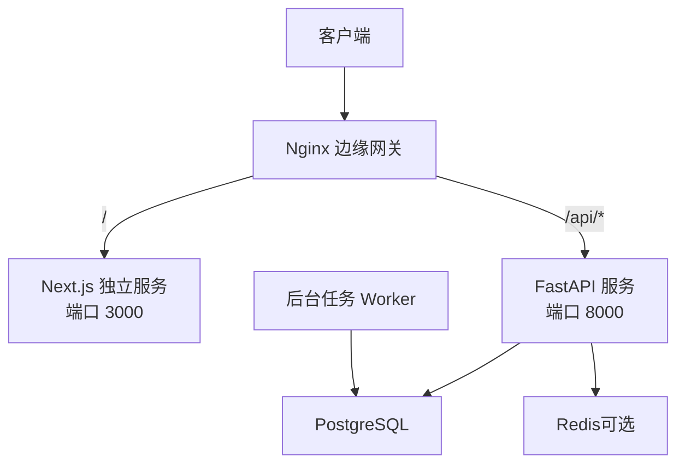
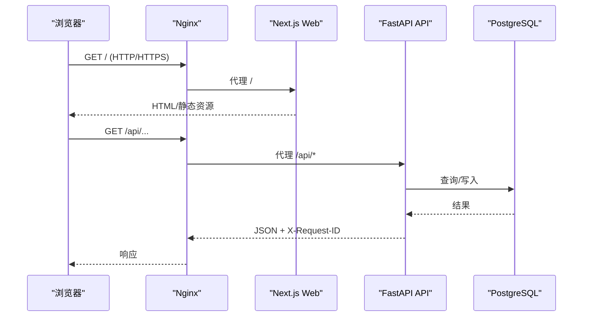
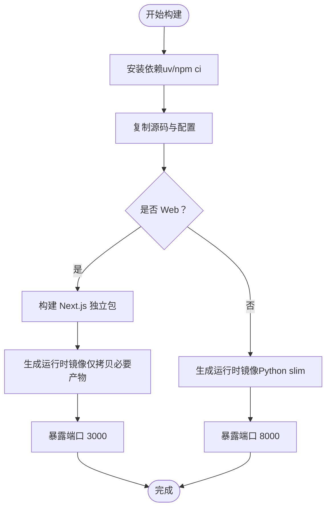
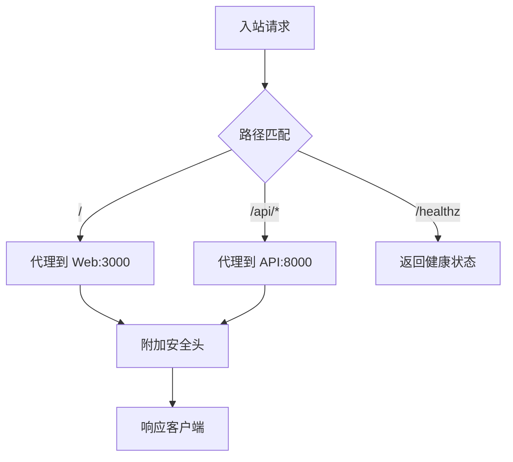
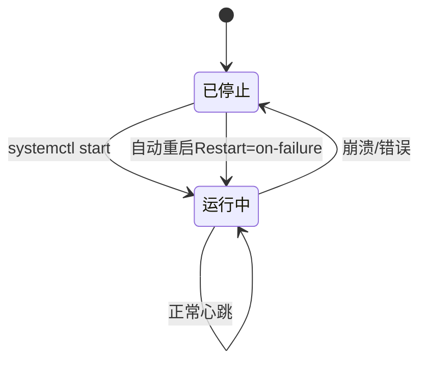
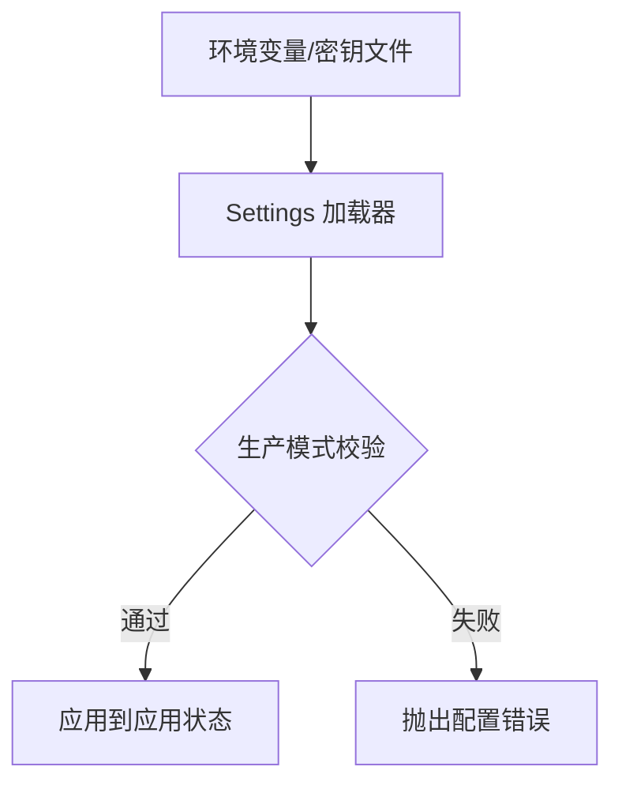
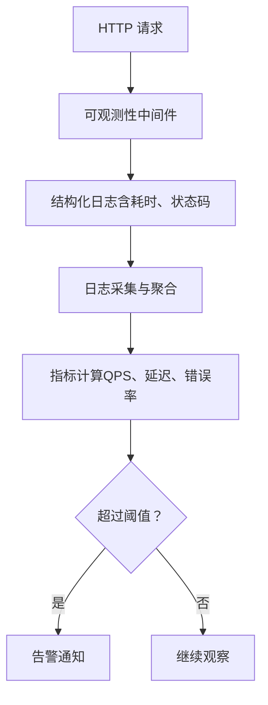
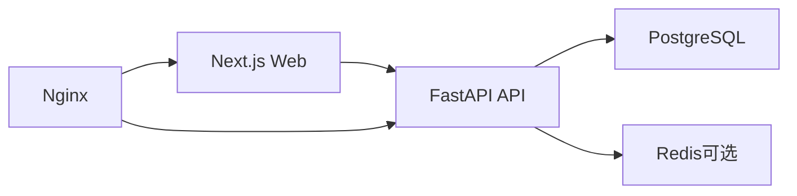

# 部署运维

<cite>
**本文引用的文件**
- [backend.Dockerfile](file://infra/docker/backend.Dockerfile)
- [web.Dockerfile](file://infra/docker/web.Dockerfile)
- [app.conf](file://infra/nginx/app.conf)
- [fateradar.conf](file://infra/nginx/fateradar.conf)
- [fateradar-tls.conf](file://infra/nginx/fateradar-tls.conf)
- [reload-nginx.sh](file://infra/letsencrypt/reload-nginx.sh)
- [compose.local.yml](file://infra/compose.local.yml)
- [fateradar-test-api.service](file://infra/systemd/fateradar-test-api.service)
- [fateradar-test-web.service](file://infra/systemd/fateradar-test-web.service)
- [fateradar-test-worker.service](file://infra/systemd/fateradar-test-worker.service)
- [config.py](file://backend/app/config.py)
- [main.py](file://backend/app/main.py)
- [next.config.ts（Web）](file://web/next.config.ts)
- [next.config.ts（Admin）](file://admin/next.config.ts)
- [observability.py](file://backend/app/observability.py)
- [database.py](file://backend/app/database.py)
- [fateradar-test.env.example](file://infra/fateradar-test.env.example)
</cite>

## 目录
1. [简介](#简介)
2. [项目结构](#项目结构)
3. [核心组件](#核心组件)
4. [架构总览](#架构总览)
5. [详细组件分析](#详细组件分析)
6. [依赖关系分析](#依赖关系分析)
7. [性能考虑](#性能考虑)
8. [故障排查指南](#故障排查指南)
9. [结论](#结论)
10. [附录](#附录)

## 简介
本指南面向生产环境的部署与运维，覆盖容器化构建、反向代理与安全、Systemd 进程守护、环境变量与密钥管理、监控告警、备份恢复、性能调优与扩容策略。内容基于仓库中现有的 Dockerfile、Nginx 配置、Systemd 单元、应用配置与可观测性代码进行说明，确保与当前实现一致并可落地执行。

## 项目结构
本项目采用前后端分离与多服务编排：
- Web（Next.js 独立输出）提供静态站点与页面渲染，通过重写将 /api/* 转发到后端。
- Backend（FastAPI + Uvicorn）提供 REST API、健康检查、速率限制与可观测性中间件。
- Worker（后台任务消费者）处理耗时任务，单副本运行并通过数据库行锁避免重复消费。
- Nginx 作为边缘网关，负责 HTTP/HTTPS、安全头、静态资源与 API 转发。
- Systemd 单元用于在单机上以最小权限运行各进程，并具备自动重启与系统加固。
- Compose 用于本地开发环境一键拉起 Postgres、Redis、API、Web、Edge。

图表来源
- [app.conf:16-43](file://infra/nginx/app.conf#L16-L43)
- [web.Dockerfile:21-26](file://infra/docker/web.Dockerfile#L21-L26)
- [backend.Dockerfile:21-22](file://infra/docker/backend.Dockerfile#L21-L22)
- [compose.local.yml:31-79](file://infra/compose.local.yml#L31-L79)

章节来源
- [compose.local.yml:1-93](file://infra/compose.local.yml#L1-L93)
- [app.conf:1-45](file://infra/nginx/app.conf#L1-L45)

## 核心组件
- 容器镜像构建
  - 后端使用 uv 同步依赖，Python 3.12 slim 运行时，暴露 8000 端口，启动命令为 Uvicorn。
  - Web 使用 Node 多阶段构建，输出 Next.js standalone 包，仅拷贝必要产物到运行时镜像，暴露 3000 端口。
- 反向代理与安全
  - app.conf 将 /api/* 反向代理到 api:8000，设置必要的代理头与安全响应头；/ 代理到 web:3000。
  - fateradar.conf 提供默认拦截、静态站点与 API 占位返回；fateradar-tls.conf 启用 HTTPS、HSTS、ACME 验证路径。
- 进程守护与加固
  - Systemd 单元以非 root 用户运行，启用 PrivateTmp、ProtectSystem=strict、RestrictAddressFamilies 等加固项，配置 Restart 与超时。
- 配置与安全
  - 应用通过 Settings 集中读取环境变量，包含严格的校验与生产模式安全约束；敏感字段使用 SecretStr。
  - Web/Admin 通过 next.config.ts 注入后端地址、CSP、私有缓存头等。
- 可观测性与健康检查
  - 请求级日志包含 request_id、方法、路径、状态码、耗时；健康检查端点由 Nginx 与应用共同提供。

章节来源
- [backend.Dockerfile:1-23](file://infra/docker/backend.Dockerfile#L1-L23)
- [web.Dockerfile:1-27](file://infra/docker/web.Dockerfile#L1-L27)
- [app.conf:16-43](file://infra/nginx/app.conf#L16-L43)
- [fateradar-tls.conf:56-84](file://infra/nginx/fateradar-tls.conf#L56-L84)
- [fateradar-test-api.service:19-52](file://infra/systemd/fateradar-test-api.service#L19-L52)
- [config.py:62-149](file://backend/app/config.py#L62-L149)
- [next.config.ts（Web）:27-62](file://web/next.config.ts#L27-L62)
- [observability.py:27-51](file://backend/app/observability.py#L27-L51)

## 架构总览
下图展示了从浏览器到后端的数据流与关键边界：
- 浏览器访问域名，Nginx 根据路径将流量分发至 Web 或 API。
- API 通过 SQLAlchemy 异步引擎连接 PostgreSQL，使用 Redis（可选）做缓存/限流。
- Worker 单副本拉取任务，利用数据库行锁保证幂等与一致性。
- 所有外部请求经 Nginx 添加安全头，API 响应携带 X-Request-ID 便于追踪。

图表来源
- [app.conf:16-43](file://infra/nginx/app.conf#L16-L43)
- [database.py:12-33](file://backend/app/database.py#L12-L33)
- [observability.py:27-51](file://backend/app/observability.py#L27-L51)

## 详细组件分析

### 容器化部署与镜像优化
- 后端镜像
  - 使用 uv 冻结依赖安装，减少镜像层与体积；仅复制源码与配置文件，不引入开发依赖。
  - 暴露 8000 端口，以 Uvicorn 启动 FastAPI 应用。
- Web 镜像
  - 多阶段构建：先安装依赖，再构建 Next.js 独立包；运行时仅拷贝 .next/standalone、静态资源与 public。
  - 以非 root 用户运行，禁用遥测，暴露 3000 端口。
- 本地编排
  - Compose 定义 Postgres、Redis、API、Web、Edge 服务，设置健康检查与端口映射，便于本地联调。

图表来源
- [backend.Dockerfile:1-23](file://infra/docker/backend.Dockerfile#L1-L23)
- [web.Dockerfile:1-27](file://infra/docker/web.Dockerfile#L1-L27)
- [compose.local.yml:31-79](file://infra/compose.local.yml#L31-L79)

章节来源
- [backend.Dockerfile:1-23](file://infra/docker/backend.Dockerfile#L1-L23)
- [web.Dockerfile:1-27](file://infra/docker/web.Dockerfile#L1-L27)
- [compose.local.yml:1-93](file://infra/compose.local.yml#L1-L93)

### Nginx 反向代理、静态缓存与安全头
- 路由与转发
  - / 代理到 Next.js 服务；/api/* 代理到 FastAPI 服务；/healthz 提供轻量健康检查。
- 安全头
  - 全局设置 X-Content-Type-Options、X-Frame-Options、Referrer-Policy、Permissions-Policy；API 路径额外设置私有缓存控制。
- HTTPS 与证书
  - TLS 配置启用 HSTS、加载 Let’s Encrypt 证书与 DH 参数；ACME 验证路径指向 /var/lib/letsencrypt；证书更新后重载 Nginx。

图表来源
- [app.conf:1-45](file://infra/nginx/app.conf#L1-L45)
- [fateradar-tls.conf:56-124](file://infra/nginx/fateradar-tls.conf#L56-L124)
- [reload-nginx.sh:1-6](file://infra/letsencrypt/reload-nginx.sh#L1-L6)

章节来源
- [app.conf:1-45](file://infra/nginx/app.conf#L1-L45)
- [fateradar.conf:1-59](file://infra/nginx/fateradar.conf#L1-L59)
- [fateradar-tls.conf:1-125](file://infra/nginx/fateradar-tls.conf#L1-L125)
- [reload-nginx.sh:1-6](file://infra/letsencrypt/reload-nginx.sh#L1-L6)

### Systemd 服务管理（进程守护、日志轮转、自动重启）
- 服务单元
  - API、Web、Worker 分别定义 Unit/Service/Install 段；指定用户组、工作目录、环境变量文件、启动命令。
  - 统一配置 Restart=on-failure、RestartSec、TimeoutStopSec，保障异常退出时自动恢复。
- 安全加固
  - 启用 NoNewPrivileges、PrivateTmp、ProtectSystem=strict、RestrictAddressFamilies 等；对 Python 服务启用 MemoryDenyWriteExecute=true。
  - Web 服务允许写入 .next/cache 目录以满足渲染缓存需求。
- 日志轮转
  - 建议配合 systemd-journald 与 logrotate 对 /var/log 下的应用日志进行轮转；可通过 journalctl 查看实时日志。

图表来源
- [fateradar-test-api.service:19-52](file://infra/systemd/fateradar-test-api.service#L19-L52)
- [fateradar-test-web.service:20-60](file://infra/systemd/fateradar-test-web.service#L20-L60)
- [fateradar-test-worker.service:23-57](file://infra/systemd/fateradar-test-worker.service#L23-L57)

章节来源
- [fateradar-test-api.service:1-56](file://infra/systemd/fateradar-test-api.service#L1-L56)
- [fateradar-test-web.service:1-64](file://infra/systemd/fateradar-test-web.service#L1-L64)
- [fateradar-test-worker.service:1-60](file://infra/systemd/fateradar-test-worker.service#L1-L60)

### 环境变量配置与密钥管理
- 配置来源
  - 应用通过 Settings 集中读取 MINGLI_* 环境变量，支持自定义源过滤敏感字段（如 DeepSeek API Key）。
  - 测试环境示例文件提供占位值，明确标注不可直接用于生产。
- 生产安全约束
  - 强制 Secure Cookie、禁止 Fake OTP/Runtime/Model 适配器、固定运行时路径与状态根、要求内容加密密钥与身份哈希密钥注入、限制模型调用参数范围。
- 密钥存储建议
  - 使用操作系统密钥环或云厂商密钥管理服务注入敏感变量；避免将真实密钥放入版本库；通过 EnvironmentFile 限定权限（如 0600）。

图表来源
- [config.py:62-186](file://backend/app/config.py#L62-L186)
- [config.py:188-329](file://backend/app/config.py#L188-L329)
- [fateradar-test.env.example:1-45](file://infra/fateradar-test.env.example#L1-L45)

章节来源
- [config.py:62-329](file://backend/app/config.py#L62-L329)
- [fateradar-test.env.example:1-45](file://infra/fateradar-test.env.example#L1-L45)

### 监控与告警
- 指标收集
  - 请求级日志包含 event、request_id、method、path、status、duration_ms；可通过日志采集系统聚合统计 QPS、P95/P99 延迟、错误率。
- 错误追踪
  - 每个响应携带 X-Request-ID；结合前端与后端日志关联问题链路。
- 容量规划
  - 依据日志中的耗时分布与错误率评估 CPU/内存/IO 瓶颈；结合数据库连接池与模型调用超时阈值调整资源配额。

图表来源
- [observability.py:27-51](file://backend/app/observability.py#L27-L51)

章节来源
- [observability.py:1-52](file://backend/app/observability.py#L1-L52)

### 备份恢复与数据迁移
- 数据库备份
  - 使用 pg_dump/pg_restore 或云托管数据库的快照功能；定期全量备份与增量 WAL 归档。
- 迁移流程
  - 应用使用 Alembic 管理迁移；发布前在预发环境执行迁移并回滚演练；生产迁移需带事务与回滚脚本。
- 恢复策略
  - 制定 RTO/RPO 目标；演练恢复流程；验证数据一致性与业务可用性。

章节来源
- [database.py:12-33](file://backend/app/database.py#L12-L33)

### 性能调优与扩容方案
- 应用层
  - 合理设置模型调用超时与最大响应字节；限制温度与输出 token 数；使用连接池与只读副本提升吞吐。
- 缓存与限流
  - 对热点接口启用 Redis 缓存；按用户/IP/路径维度实施速率限制；Nginx 层开启 gzip/brotli 与静态资源缓存。
- 水平扩展
  - Web 与 API 无状态，可横向扩容；Worker 保持单副本或使用分布式队列+分片键避免重复消费。
- 资源隔离
  - 使用 cgroups/systemd 限制 CPU/内存；容器化部署便于弹性伸缩。

章节来源
- [config.py:253-291](file://backend/app/config.py#L253-L291)
- [app.conf:16-43](file://infra/nginx/app.conf#L16-L43)

## 依赖关系分析
- 服务间依赖
  - Web 依赖 API（构建时内嵌 BACKEND_INTERNAL_URL）；API 依赖 PostgreSQL；可选依赖 Redis。
- 配置依赖
  - Settings 严格校验生产模式；Web/Admin 通过 next.config.ts 注入后端地址与安全头。
- 运行时依赖
  - Nginx 作为入口，统一安全头与转发；Systemd 单元管理进程生命周期。

图表来源
- [next.config.ts（Web）:27-38](file://web/next.config.ts#L27-L38)
- [next.config.ts（Admin）:27-38](file://admin/next.config.ts#L27-L38)
- [app.conf:16-43](file://infra/nginx/app.conf#L16-L43)
- [database.py:12-33](file://backend/app/database.py#L12-L33)

章节来源
- [next.config.ts（Web）:1-66](file://web/next.config.ts#L1-L66)
- [next.config.ts（Admin）:1-65](file://admin/next.config.ts#L1-L65)
- [app.conf:1-45](file://infra/nginx/app.conf#L1-L45)
- [database.py:1-33](file://backend/app/database.py#L1-L33)

## 性能考虑
- 网络与缓存
  - Nginx 层启用压缩与静态资源缓存；API 层对写操作禁用缓存，读操作可按需缓存。
- 数据库
  - 使用连接池与健康检查；慢查询分析与索引优化；读写分离与只读副本。
- 应用
  - 限制模型调用超时与响应大小；合理设置温度与 token 上限；避免大对象传输。
- 资源
  - 容器资源限制与请求；CPU/Memory 配额与弹性伸缩策略。

[本节为通用指导，不直接分析具体文件]

## 故障排查指南
- 常见问题定位
  - 健康检查失败：检查 Nginx /healthz 与应用健康端点；确认服务端口与依赖可达。
  - 请求 502/504：检查 Nginx 到上游的连接与超时；查看应用日志中的耗时与错误。
  - 认证与 Cookie：确认 MINGLI_COOKIE_SECURE 与环境匹配；检查 CSP 与跨域策略。
- 日志与追踪
  - 使用 journalctl 查看 Systemd 服务日志；通过 X-Request-ID 关联前后端日志。
- 配置错误
  - 启动时报错多为配置校验失败；对照 Settings 的生产约束逐项核对。

章节来源
- [app.conf:10-14](file://infra/nginx/app.conf#L10-L14)
- [fateradar-tls.conf:75-79](file://infra/nginx/fateradar-tls.conf#L75-L79)
- [observability.py:27-51](file://backend/app/observability.py#L27-L51)
- [config.py:188-329](file://backend/app/config.py#L188-L329)

## 结论
本指南基于仓库现有实现，提供了从容器化构建、反向代理与安全、Systemd 守护、环境变量与密钥管理、监控告警到备份恢复与性能调优的完整运维方案。遵循这些实践可确保系统在稳定、安全、可观测的前提下高效运行，并为后续扩容与演进奠定基础。

## 附录
- 快速启动（本地）
  - 使用 Compose 拉起 Postgres、Redis、API、Web、Edge；访问 http://127.0.0.1:8080 验证入口。
- 生产上线清单
  - 配置 HTTPS 与证书；注入生产密钥；启用告警与日志采集；执行迁移与回滚演练；设定备份策略。

章节来源
- [compose.local.yml:1-93](file://infra/compose.local.yml#L1-L93)
- [fateradar-tls.conf:56-124](file://infra/nginx/fateradar-tls.conf#L56-L124)
- [config.py:62-329](file://backend/app/config.py#L62-L329)