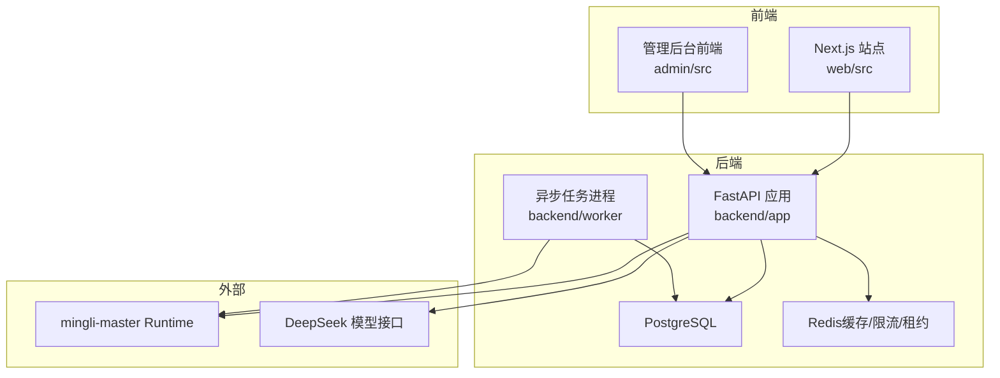
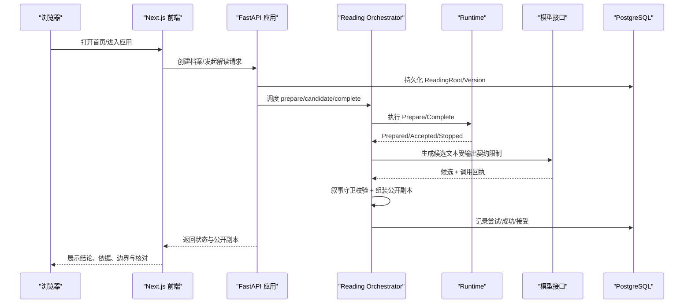
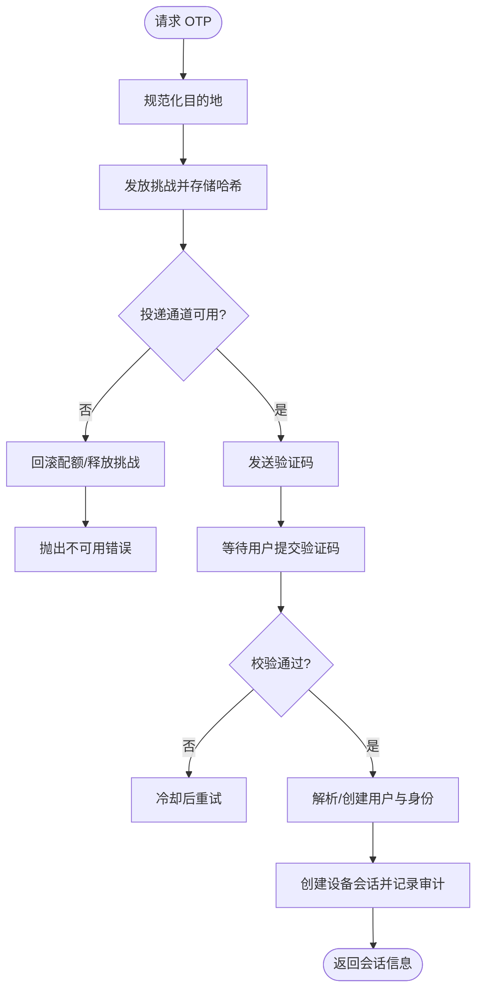
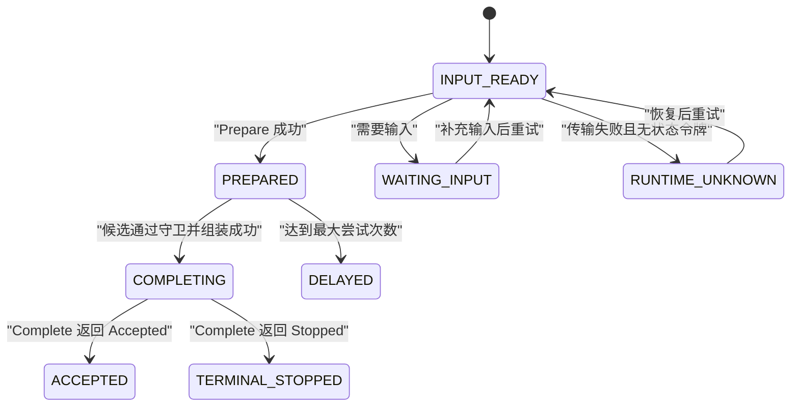
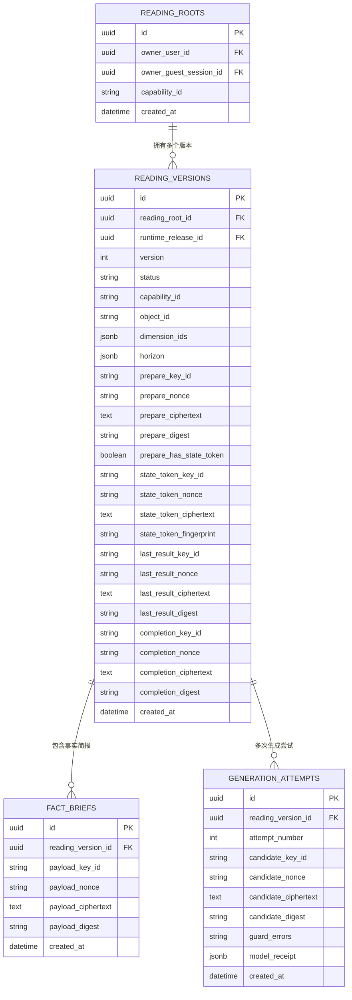
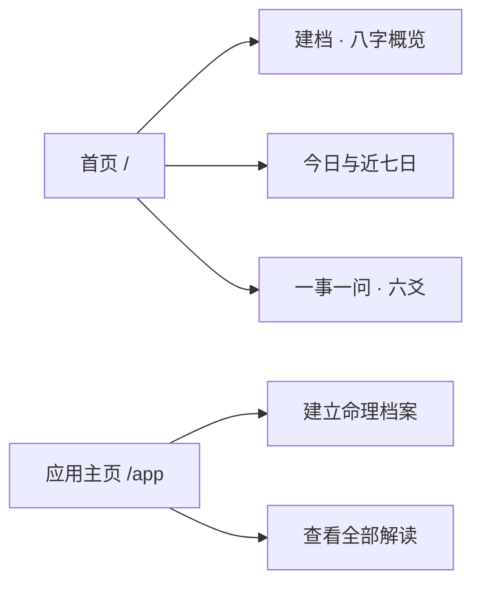
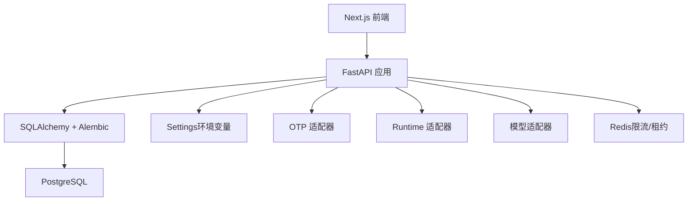

# 项目概述

<cite>
**本文引用的文件**
- [README.md](file://README.md)
- [PRODUCT.md](file://PRODUCT.md)
- [DESIGN.md](file://DESIGN.md)
- [backend/app/main.py](file://backend/app/main.py)
- [backend/app/config.py](file://backend/app/config.py)
- [backend/app/readings/orchestrator.py](file://backend/app/readings/orchestrator.py)
- [backend/app/identity/service.py](file://backend/app/identity/service.py)
- [web/src/app/page.tsx](file://web/src/app/page.tsx)
- [web/src/lib/product-capabilities.ts](file://web/src/lib/product-capabilities.ts)
- [web/src/app/app/page.tsx](file://web/src/app/app/page.tsx)
- [infra/compose.local.yml](file://infra/compose.local.yml)
- [docs/adr/0001-use-a-modular-monolith-on-alibaba-cloud.md](file://docs/adr/0001-use-a-modular-monolith-on-alibaba-cloud.md)
- [docs/PRODUCT_BLUEPRINT_WEB_IOS_V2.md](file://docs/PRODUCT_BLUEPRINT_WEB_IOS_V2.md)
</cite>

## 目录
1. [简介](#简介)
2. [项目结构](#项目结构)
3. [核心组件](#核心组件)
4. [架构总览](#架构总览)
5. [关键组件详解](#关键组件详解)
6. [依赖关系分析](#依赖关系分析)
7. [性能与可靠性](#性能与可靠性)
8. [故障排查指南](#故障排查指南)
9. [结论](#结论)
10. [附录：快速开始](#附录快速开始)

## 简介
Mingli Web（产品名 FateRadar）是一个采用模块化单体架构的现代化命理咨询平台，目标是为普通用户提供“先算再讲”的可复现、可核对的个人命理档案服务。P0 聚焦三大能力：八字建档与概览、今日与近七日运势节奏、一事一问·六爻事件解读；同时提供管理后台用于审计、订单与用户管理。

技术愿景是以确定性计算为核心、以模型为白话组织层，通过显式编排器串联准备、生成、校验与交付，确保结果可追踪、可审计、可回滚。安全设计强调最小化数据暴露、不可变版本化、服务端密钥注入与生产门禁约束。

当前阶段：Phase 0/1 已完成基础（Next.js 公共/私人站点壳、FastAPI 模块化单体、PostgreSQL 首版迁移、独立 Worker、Guest Session、OTP、CSRF 与同源 /api），Phase 2 正在深化核心功能（冻结 Command/Result/Candidate/Output Contract，完善 Runtime/Model Ports、Request Compiler、Narrative Guard 与显式 Reading Orchestrator）。

**章节来源**
- [README.md:5-113](file://README.md#L5-L113)
- [PRODUCT.md:15-47](file://PRODUCT.md#L15-L47)
- [docs/PRODUCT_BLUEPRINT_WEB_IOS_V2.md:22-68](file://docs/PRODUCT_BLUEPRINT_WEB_IOS_V2.md#L22-L68)

## 项目结构
仓库采用前后端同仓、领域模块化的组织方式：
- web：Next.js App Router + TypeScript，负责公共页面、私人应用与管理后台前端。
- backend：Python + FastAPI 模块化单体，包含身份认证、档案、命理解读、管理后台等模块；独立 worker 进程处理异步任务。
- contracts：OpenAPI 与 JSON Schema 合同，保障前后端与运行时契约稳定。
- infra：本地 Docker Compose、Nginx 配置与运行手册。
- tests/contract：跨模块合同测试，保证 API 与 Schema 一致性。

**图表来源**
- [infra/compose.local.yml:31-67](file://infra/compose.local.yml#L31-L67)
- [backend/app/main.py:50-140](file://backend/app/main.py#L50-L140)

**章节来源**
- [README.md:24-35](file://README.md#L24-L35)
- [infra/compose.local.yml:1-93](file://infra/compose.local.yml#L1-L93)

## 核心组件
- 身份与会话：访客会话、设备会话、OTP 验证码、登录身份绑定与审计。
- 档案与解读：不可变档案版本、Reading Root/Version、Fact Brief、Generation Attempt、Accepted Copy。
- 命理解读编排：Reading Orchestrator 驱动 prepare → candidate → validate → complete → Accepted 状态机。
- 管理与审计：管理员登录、审计日志、订单与退款视图。
- 合同与质量：OpenAPI、JSON Schema、合同测试与迁移。

**章节来源**
- [backend/app/identity/service.py:35-192](file://backend/app/identity/service.py#L35-L192)
- [backend/app/readings/models.py:53-200](file://backend/app/readings/models.py#L53-L200)
- [backend/app/readings/orchestrator.py:178-450](file://backend/app/readings/orchestrator.py#L178-L450)
- [backend/app/admin/service.py](file://backend/app/admin/service.py)
- [contracts/openapi/v1.yaml](file://contracts/openapi/v1.yaml)

## 架构总览
系统采用模块化单体：Web 与 Admin 前端通过同源 /api 访问 FastAPI；FastAPI 将业务逻辑拆分为 identity、profiles、readings、admin 等模块；读取命理解析由独立的 mingli-master Runtime 执行，自然语言叙述由 DeepSeek 模型完成；PostgreSQL 作为事实源，Redis 用于限流与短期租约。

**图表来源**
- [backend/app/readings/orchestrator.py:212-450](file://backend/app/readings/orchestrator.py#L212-L450)
- [backend/app/main.py:50-140](file://backend/app/main.py#L50-L140)
- [infra/compose.local.yml:31-67](file://infra/compose.local.yml#L31-L67)

## 关键组件详解

### 身份与会话（Guest/Device/OTP）
- 访客会话：生成不透明 token 与 CSRF token，短期有效，仅承载草稿与试算关联。
- 设备会话：OTP 验证成功后建立设备级会话，保存 token_hash 与 csrf_token_hash。
- OTP 流程：支持 fake/smtp/disabled 适配器；生产环境禁用 fake，要求强校验与限流。
- 安全要点：手机号/邮箱经规范化与 HMAC 标识，业务外键使用内部 User UUID；审计事件记录登录行为。

**图表来源**
- [backend/app/identity/service.py:100-192](file://backend/app/identity/service.py#L100-L192)

**章节来源**
- [backend/app/identity/service.py:23-192](file://backend/app/identity/service.py#L23-L192)
- [backend/app/config.py:122-145](file://backend/app/config.py#L122-L145)

### 命理解读编排（Reading Orchestrator）
- 状态机：INPUT_READY → PREPARED → COMPLETING → ACCEPTED；异常路径包括 WAITING_INPUT、TERMINAL_STOPPED、DELAYED、RUNTIME_UNKNOWN。
- 准备阶段：调用 Runtime Prepare，处理 need_input 或传输失败退避。
- 生成阶段：调用模型生成候选文本，关闭引用、叙事守卫校验、组装公开副本；失败则记录尝试并可能延迟重试。
- 完成阶段：调用 Runtime Complete，校验 state_token 与 public_copy 一致性，记录 Accepted。

**图表来源**
- [backend/app/readings/orchestrator.py:212-450](file://backend/app/readings/orchestrator.py#L212-L450)

**章节来源**
- [backend/app/readings/orchestrator.py:43-176](file://backend/app/readings/orchestrator.py#L43-L176)
- [backend/app/readings/orchestrator.py:250-450](file://backend/app/readings/orchestrator.py#L250-L450)

### 数据模型与不可变版本
- ReadingRoot/Version：绑定用户或访客会话、能力 ID、对象 ID、维度、时间范围；状态与加密信封字段成对存在。
- FactBrief：存储加密的事实简报载荷与摘要。
- GenerationAttempt：记录每次模型调用、候选、守卫错误与回执。
- 约束：唯一性约束与检查约束确保完整性与一致性。

**图表来源**
- [backend/app/readings/models.py:53-200](file://backend/app/readings/models.py#L53-L200)

**章节来源**
- [backend/app/readings/models.py:28-200](file://backend/app/readings/models.py#L28-L200)

### 前端能力注册与页面入口
- 能力注册：PRODUCT_CAPABILITIES 定义 P0 三项能力（八字、运势、六爻），统一驱动导航、首页卡片与页脚链接。
- 首页：展示价值主张、三个任务入口与方法论说明，强调私密性与证据分层。
- 应用主页：汇总档案、八字概览、六爻入口与历史解读。

**图表来源**
- [web/src/lib/product-capabilities.ts:34-92](file://web/src/lib/product-capabilities.ts#L34-L92)
- [web/src/app/page.tsx:102-279](file://web/src/app/page.tsx#L102-L279)
- [web/src/app/app/page.tsx:9-80](file://web/src/app/app/page.tsx#L9-L80)

**章节来源**
- [web/src/lib/product-capabilities.ts:1-140](file://web/src/lib/product-capabilities.ts#L1-L140)
- [web/src/app/page.tsx:1-279](file://web/src/app/page.tsx#L1-L279)
- [web/src/app/app/page.tsx:1-80](file://web/src/app/app/page.tsx#L1-L80)

## 依赖关系分析
- 前端依赖 Next.js、CSS Modules、Radix、Zod、React Hook Form 与设计系统 token。
- 后端依赖 FastAPI、SQLAlchemy、Alembic、Pydantic Settings；通过适配器接入 OTP、支付、Runtime、模型。
- 基础设施依赖 PostgreSQL 与 Redis；部署在阿里云 ECS，Worker 与 API 共用领域代码但独立进程。

**图表来源**
- [backend/app/main.py:50-140](file://backend/app/main.py#L50-L140)
- [backend/app/config.py:62-149](file://backend/app/config.py#L62-L149)
- [infra/compose.local.yml:31-67](file://infra/compose.local.yml#L31-L67)

**章节来源**
- [docs/adr/0001-use-a-modular-monolith-on-alibaba-cloud.md:6-13](file://docs/adr/0001-use-a-modular-monolith-on-alibaba-cloud.md#L6-L13)
- [backend/app/config.py:62-149](file://backend/app/config.py#L62-L149)

## 性能与可靠性
- 速率限制：访客会话创建、解读写入、档案写入、管理员登录均设置窗口限流，防止滥用与资源耗尽。
- 超时与预算：模型连接/读取/总体超时、响应体大小、温度与最大输出 token 均有上限；生产环境强制固定路径与发布制品校验。
- 幂等与重放：Complete 携带 state_token，失败时按退避策略重试；已提交的完成意图可安全重放一次。
- 可观测性：请求观察、告警事件（运行时未知、守卫拒绝、延迟、模型成本）便于监控与排障。

**章节来源**
- [backend/app/main.py:73-88](file://backend/app/main.py#L73-L88)
- [backend/app/config.py:126-149](file://backend/app/config.py#L126-L149)
- [backend/app/readings/orchestrator.py:186-194](file://backend/app/readings/orchestrator.py#L186-L194)
- [backend/app/readings/orchestrator.py:312-394](file://backend/app/readings/orchestrator.py#L312-L394)

## 故障排查指南
- 启动问题：确认数据库与 Redis 健康；检查环境变量（如 MINGLI_DATABASE_URL、MINGLI_OTP_ADAPTER、MINGLI_IDENTITY_HASH_KEY）。
- 认证失败：检查 OTP 适配器配置与冷却时间；查看审计事件与限流是否触发。
- 解读卡住：关注 Reading Status（WAITING_INPUT、DELAYED、RUNTIME_UNKNOWN）；检查 Runtime 传输错误与退避策略。
- 模型异常：查看生成尝试记录与守卫错误；确认模型超时、响应大小与价格快照配置。
- 生产门禁：确保 cookie_secure、非 fake OTP/Runtime/Model、固定路径与发布摘要一致。

**章节来源**
- [infra/compose.local.yml:31-67](file://infra/compose.local.yml#L31-L67)
- [backend/app/config.py:188-329](file://backend/app/config.py#L188-L329)
- [backend/app/readings/orchestrator.py:250-450](file://backend/app/readings/orchestrator.py#L250-L450)

## 结论
Mingli Web 以“确定性事实 + 可核对依据 + 隐私优先”为核心，通过显式编排器与不可变版本化构建可信的命理档案体验。Phase 0/1 已打通基础链路，Phase 2 正围绕契约冻结与 Runtime/Model 端口深化核心能力。未来可在保持模块化单体优势的前提下，逐步扩展更多术法与渠道，同时严格遵循安全与合规门禁。

[本节为总结性内容，不直接分析具体文件]

## 附录：快速开始
- 环境要求：Node.js 22+、Python 3.12、uv、PostgreSQL 16；Docker 可选。
- 安装依赖：
  - 后端：uv sync --project backend --group dev
  - 前端：npm install --prefix web
- 初始化数据库：alembic upgrade head
- 启动服务：
  - API：uv run --project backend uvicorn app.main:app --app-dir backend --reload --port 8000
  - Worker：uv run --directory backend python -m worker.main --poll-interval 2
  - Web：npm --prefix web run dev
- 访问地址：http://127.0.0.1:3000；如需完整同源入口可使用 Docker Compose 从 http://127.0.0.1:8080 启动。

**章节来源**
- [README.md:39-73](file://README.md#L39-L73)
- [infra/compose.local.yml:68-93](file://infra/compose.local.yml#L68-L93)