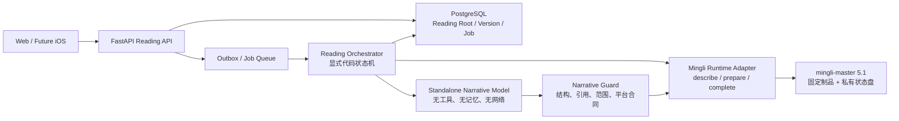
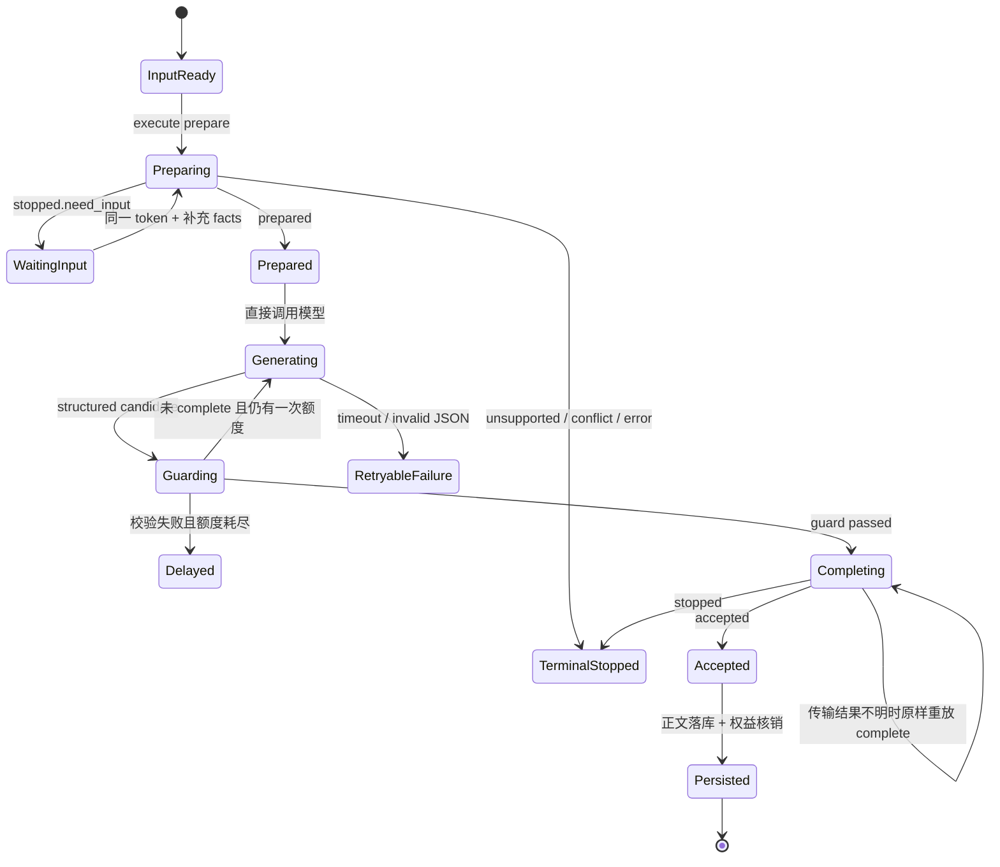

# mingli-master 5.1 网站单模型接入合同

> 决策日期：2026-08-09
> 状态：Accepted，命理算法与成稿链的权威实施合同
> 适用范围：网站 P0/P1；未来 iOS 继续复用同一后端
> 上位蓝图：[PRODUCT_BLUEPRINT_WEB_IOS_V2.md](./PRODUCT_BLUEPRINT_WEB_IOS_V2.md)
> 相关 ADR：[0010-replace-agent-loop-with-an-explicit-reading-orchestrator.md](./adr/0010-replace-agent-loop-with-an-explicit-reading-orchestrator.md)

## 1. 最终决定

网站不移植 Codex/Hermes 的 Agent，也不把整套命理技能塞进一个超长 Prompt。

网站保留 mingli-master 5.1 的确定性计算核心，用普通业务代码实现一个显式的 `Reading Orchestrator`。它依次调用：

1. mingli-master `prepare`，得到唯一可用于写作的 `ReadingBrief`；
2. 一个独立大模型的一次直接结构化生成；
3. 网站自己的确定性 `Narrative Guard`；
4. mingli-master `complete`；
5. 原样保存并交付 `Accepted.public_copy`。

正常路径只有一次大模型调用。没有工具调用、没有自主规划、没有多 Agent、没有模型自己选 Provider、没有模型访问数据库或网络，也没有模型反复决定下一步做什么。校验失败时最多按商品版本配置做一次干净重生，这是有限状态重试，不是 Agent 循环。

一句话概括：**核心负责算，代码负责走流程，单模型负责写，Guard 负责在提交前守合同。**

## 2. 已审计的 5.1 制品身份

当前接入设计依据的本地安装制品已经逐文件核对：

| 项目 | 冻结值 |
|---|---|
| Skill 名称/版本 | `mingli-master` / `5.1` |
| Release | `mingli-master-portable-core` |
| Source commit | `494ce0bba174a77800daf9b9c38ce9c9166d9a94` |
| Release manifest 文件数 | 217 |
| Release manifest SHA-256 | `e8d4111342d2334868bfa570d31c4105126301e44766a9f5482236db19f2bf68` |
| `SKILL.md` SHA-256 | `ee43ae256f2a39c7bf0fde6714d5ff87af2b654cae2283ee0b6d07566502c378` |
| 协议 | `mingli-portable-interface-v2` |
| 当前 `describe.manifest_digest` | `7ddbc04a04cad101dc1ab4951982c60b3138ffbb1b09463c64df719c69940342` |

这些值是首个服务器制品的验收输入，不是允许手工修改的配置。任何文件、Provider manifest 或协议变化都必须形成新的 Runtime Release，重新跑黄金样例后再灰度。

当前机器上的完整源码导出包含测试，但不是 Git 工作树。生产打包前仍须归档可验证的上述 source commit、完整测试源码和逐文件验签结果；仅凭一个散落目录不能宣称服务器发布完成。

### 2.1 完整发布物范围

网站迁移、生产打包和 Runtime 验收的对象始终是**完整、原样的 5.1 发布物**，不是只保留首发页面会调用的三个能力。当前发布物包含 13 个 Provider：

| Capability | 中文体系 |
|---|---|
| `bazi` | 八字 |
| `fengshui` | 风水 |
| `fortune` | 日运/近时运势 |
| `liuren` | 大六壬 |
| `liuyao` | 六爻 |
| `luming-nayin` | 禄命/纳音 |
| `meihua` | 梅花易数 |
| `physiognomy` | 相法 |
| `qimen` | 奇门遁甲 |
| `selection` | 择日 |
| `taiyi` | 太乙 |
| `xingming` | 星命/七政四余 |
| `ziwei` | 紫微斗数 |

发布物还包含 55/55 个古籍 reference pack、1328 条 evidence index 记录、各体系的规则矩阵、事实适配器、来源映射、边界与回归资产。不得为了 P0 缩小镜像而删除未开放 Provider、古籍目录、证据索引、vendored engine 或其测试。

这里必须分清三个范围：

1. **Runtime 制品范围**：完整 13 个 Provider 和全部算法/古籍资产，原样打包；
2. **Runtime 准入范围**：完整制品逐文件验签，13/13 Provider、55/55 reference pack、1328 条 evidence index 和全量回归均通过；
3. **产品曝光范围**：P0 页面和业务 API 暂时只允许 `bazi`、`fortune`、`liuyao`。

第三项是产品节奏，不得反向裁剪前两项。

## 3. 5.1 真正提供了什么

5.1 的外部接口只有三个 JSON Command：

- `describe`
- `prepare`
- `complete`

结果只有四类：

- `described`
- `prepared`
- `accepted`
- `stopped`

它没有模型层，也没有大模型供应商配置。模型智能与自然中文一直属于调用方；5.1 提供的是确定性事实、证据、可表达范围、限制、连续状态和原子接纳。

### 3.1 一个必须明确的事实

当前 5.1 的公开 `complete` 只验证：

- `state_token` 是否有效；
- `public_copy` 是否是非空字符串；
- 当前 token 是否仍允许首次原子提交。

它不会再次判断自然语言是否忠于 `brief`。因此，所有候选稿合同校验必须在网站调用 `complete` **之前**完成。第一次成功提交会永久成为该版本的 Accepted Copy；重放同一 token 只能拿回第一次接纳的正文。

### 3.2 ReadingBrief 是唯一写作材料

`prepared.brief` 的公开字段为：

- `question`
- `vocabulary`
- `facts`
- `evidence`
- `findings`
- `claim_scopes`
- `limits`
- `prior_answer`
- `request_view`

大模型写作时只能看到这份 brief 加上不含新事实的商品输出合同。它不能再查数据库、用户记忆、聊天全文、互联网、RAG 或其他命理资料。续问需要的上一版正文由核心通过 `prior_answer` 明确投影进 brief。

### 3.3 古籍和算法如何进入答案

55 个古籍 reference pack 和 1328 条 evidence index 记录留在确定性核心侧。Provider 在 `prepare` 中先完成本体系计算、规则匹配和证据检索，只把**本次问题实际命中的**事实、finding、evidence、claim scope 与 limit 投影进 `ReadingBrief`。模型只能解释这份投影，不能浏览整套古籍，也不能自行补出处。

因此“模型只看 Brief”不等于“古籍没有迁移”，而是把职责固定为：完整语料与算法由核心管理，相关证据由核心筛选，模型只负责对已选中的材料成稿。零命中必须保持零；把整套古籍塞进 Prompt 或另建一个让模型自由检索的 RAG 都会破坏这个边界。

## 4. 没有 Agent 后，各项职责由谁接手

| 以前宿主/Agent 可能承担的事 | 网站中的固定替代者 |
|---|---|
| 判断调用哪种术法 | 页面入口与 Product/Capability 映射 |
| 判断对象、时间窗和主题 | 结构化表单与后端 Request Compiler |
| 补收资料 | `Stopped.need_input.input_request` 驱动的表单 |
| 记住同盘上下文 | Reading Root/Version + 加密 `state_token` |
| 调用计算工具 | Runtime Adapter 单次 JSON 子进程 |
| 把事实写成人话 | 一个独立 Narrative Model |
| 检查引用、范围、长度 | 确定性 Narrative Guard |
| 决定是否重试 | Reading Orchestrator 的有限状态机 |
| 交付最终文字 | `Accepted.public_copy` 原样落库与返回 |

模型不再承担路由、资料补全、状态管理、算法调用、支付、权益或重试决策。

## 5. 目标架构



外部深模块接口冻结为：

```text
MingliRuntime.execute(Command) -> Result
ReadingOrchestrator.run(ReadingJobId) -> ReadingOutcome
NarrativeModel.generate(NarrativeRequest) -> NarrativeCandidate
NarrativeGuard.validate(Candidate, Brief, OutputContract) -> GuardResult
```

生产实现与测试 Fake 都实现同一接口。业务后端不得 import `reading_engine`，也不得复制 Provider 算法。

## 6. 完整 Runtime 与 P0 Capability 白名单

5.1 的完整 Runtime 必须 `describe` 出并通过验收的 13 个能力；网站首发只开放其中三个。新增能力不能因为核心“已经有”就自动出现在页面，但也不能因为页面尚未开放就从 Runtime 制品、验签或回归中删掉。

| 网站任务 | Capability | object | horizon | 说明 |
|---|---|---|---|---|
| 建档、免费概览、个人深度解读 | `bazi` | `natal` | `life`，或明确选择的 `year/month/day` | 本命与中长时间范围 |
| 今日 | `fortune` | `near_time_personal` | `day` | 近时单日事实 |
| 近七日 | `fortune` | `near_time_personal` | `week` | 近时七日事实 |
| 一事一问 | `liuyao` | `concrete_event` | `instant` | 明确问题与明确起卦方式 |

首发 allowlist 为：

```json
{
  "bazi": ["natal", "life", "year", "month", "day"],
  "fortune": ["near_time_personal", "day", "week"],
  "liuyao": ["concrete_event", "instant"]
}
```

`describe` 用于验证完整 13 能力发布物并生成字段元数据；独立的 Product Capability Policy 再把可被页面和 API 选择的范围收窄到上述三项。页面路由不让模型从 13 个能力里自由猜。

## 7. 三类首发请求的准确映射

### 7.1 八字

`facts` 必须按 `subject_ref -> fields` 两层传入，不能把出生字段直接放在顶层。

```json
{
  "kind": "prepare",
  "query": "看一下这个八字，事业上最该先抓住哪条主线？",
  "intent": {
    "subject_refs": ["profile-version:<uuid>"],
    "object_id": "natal",
    "dimension_ids": ["career"],
    "horizon": {"kind_id": "life", "start": null, "end": null},
    "capability_id": "bazi",
    "comparisons": []
  },
  "facts": {
    "profile-version:<uuid>": {
      "birth_datetime_or_four_pillars": "1994-04-30T05:55:00+08:00",
      "timezone": "Asia/Shanghai",
      "location": "福建省福州市",
      "gender": "female",
      "time_basis_policy": "civil",
      "zi_hour_policy": "midnight",
      "longitude": 119.2965,
      "latitude": 26.0745,
      "coordinate_source": "user_confirmed"
    }
  },
  "state_token": null,
  "transition": null
}
```

核心硬性最少要求是 `birth_datetime_or_four_pillars`。网站产品为了可复现性还应确认时区、地点、性别、时间口径和子时策略；经纬度未知时不能伪造精度。

### 7.2 今日与近七日

`fortune` 不是把 `bazi` 强行改成短回答。它有独立的日/周事实合同，必填字段为：

- `birth_datetime`
- `timezone`
- `location`
- `gender`
- `reference_datetime`

```json
{
  "kind": "prepare",
  "query": "看一下这周运势",
  "intent": {
    "subject_refs": ["profile-version:<uuid>"],
    "object_id": "near_time_personal",
    "dimension_ids": [],
    "horizon": {
      "kind_id": "week",
      "start": "2026-08-03",
      "end": "2026-08-09"
    },
    "capability_id": "fortune",
    "comparisons": []
  },
  "facts": {
    "profile-version:<uuid>": {
      "birth_datetime": "1994-04-30T05:55:00+08:00",
      "timezone": "Asia/Shanghai",
      "location": "福建省福州市",
      "gender": "female",
      "reference_datetime": "2026-08-03T09:00:00+08:00",
      "time_basis_policy": "civil",
      "zi_hour_policy": "midnight"
    }
  },
  "state_token": null,
  "transition": null
}
```

日期、时区偏移和周边界由服务器规范化，客户端只提交用户选择；不得依赖浏览器本地时区偷偷改变目标日期。

### 7.3 六爻一事一问

必填字段为：

- `cast`
- `event_datetime`
- `timezone`
- `location`

`cast` 只允许：

- 用户实际六次投掷值 `[6, 7, 8, 9, ...]`，顺序为自下而上；
- 明确选择 `"digital_coin"`，由核心用安全随机源完成并保存可重放的起卦事实。

按时间自动代替六爻起卦当前是 `unsupported`，不能偷偷改用梅花易数。

```json
{
  "kind": "prepare",
  "query": "这次岗位面试能否进入下一轮？",
  "intent": {
    "subject_refs": ["user:<uuid>"],
    "object_id": "concrete_event",
    "dimension_ids": ["career", "outcome", "timing"],
    "horizon": {"kind_id": "instant", "start": null, "end": null},
    "capability_id": "liuyao",
    "comparisons": []
  },
  "facts": {
    "user:<uuid>": {
      "cast": [9, 7, 7, 7, 7, 6],
      "event_datetime": "2026-08-09T20:10:00+08:00",
      "timezone": "Asia/Shanghai",
      "location": "上海"
    }
  },
  "state_token": null,
  "transition": null
}
```

问题主题由用户在 UI 选择，映射到允许的 dimension。P0 不增加一次“意图路由模型调用”。

## 8. Reading Orchestrator 状态机



### 8.1 `stopped` 的固定处理

| reason | 网站行为 |
|---|---|
| `need_input` | 保存返回的 token，按 `input_request.requirements[].any_of` 收集结构化字段，再用同一 token 调 `prepare` |
| `unsupported` | 原样展示 `public_copy`，不换术法、不改用户问题、不自动重试 |
| `conflict` | 结束本轮，刷新最新 Reading Version；不并发猜测新的 token |
| `error` | 标记本轮失败或延迟交付；不通过改变参数语义盲重试 |

只有 `need_input` 是正常可恢复的补资料分支。

### 8.2 新问、追问、更正、重起

| 用户动作 | state token | transition | 业务对象 |
|---|---|---|---|
| 全新解读 | 不传 | `null` | 新 Reading Root |
| 同盘追问 | 传最近 Accepted token | `null` | 同 Root 新 Version |
| 纠正已输入事实 | 传最近 token | `correct` | 同 lineage 新 Version，保留旧版本 |
| 换资料、换卦、换事件 | 默认不传 | `null` | 新 Root；需要显式记录谱系时才用 `restart` |

不能靠“再看一下”“重算”等关键词推断 transition；必须由产品动作明确表达。

### 8.3 不能随便重试 `prepare`

不带 token 的同一 `prepare` 请求，5.1 会有意创建新的 Reading Root。尤其数字投币会生成新的安全随机卦。

因此：

- 业务 Job 必须有唯一键，避免同一个用户动作并发执行两次；
- 已收到 `prepared` 或 `need_input` 后必须持久化 token；
- 子进程启动后若发生“结果是否返回不明”的传输故障，不得自动再发一个无 token `prepare`；
- 该情况进入 `runtime_unknown` 人工/恢复队列，避免悄悄重起一盘。

`complete` 不同：同一 token、同一候选稿可安全重放，核心会返回第一次接纳的正文。

## 9. 单独大模型的调用合同

### 9.1 模型能看到什么

模型请求只含：

```text
Narrative Policy Version
Product Output Contract Version
Prepared ReadingBrief
语言、长度与结构上限
```

模型看不到：

- `state_token`；
- User、订单、支付和权益 ID；
- 数据库、对象存储、历史聊天或环境记忆；
- 任何工具、网页搜索、RAG 或内部 Provider 文件；
- 系统密钥与供应商配置。

### 9.2 Prompt 分层

1. **Narrative Policy**：从 5.1 的成稿规则固化出的版本化系统合同；负责直答、自然中文、不造事实、不暴露内部结构、服从 certainty/limit。
2. **Output Contract**：由 Product Version 指定长度、可见主题、段落数量和是否属于正式报告；它只能缩小范围，不能增加 brief 中不存在的事实。
3. **ReadingBrief**：本轮唯一领域资料。

不要每次把整个 `SKILL.md`、源码、古籍库或产品数据库拼进 Prompt。那会扩大攻击面、增加成本，并破坏 brief 的闭世界边界。

### 9.3 结构化 Candidate

模型必须按严格 JSON Schema 返回，不直接返回裸 Markdown：

```json
{
  "schema_version": "mingli-narrative-candidate-v1",
  "blocks": [
    {
      "block_id": "b1",
      "block_type": "claim",
      "text": "事业主线更适合先抓住可持续积累，而不是频繁换方向。",
      "subject_ref": "profile-version:<uuid>",
      "dimension_id": "career",
      "claim_kind_id": "kind.tendency",
      "certainty_id": "certainty.tendency",
      "fact_refs": ["fact:..."],
      "finding_refs": ["finding:..."],
      "evidence_refs": ["evidence:..."],
      "limit_kind_ids": []
    }
  ]
}
```

内部 blocks 是可校验的写作轨迹，不是固定展示标题。`public_copy` 由服务器按顺序连接 `text`；只有用户明确选择的报告商品，Output Contract 才能要求固定章节。

### 9.4 Narrative Guard

Guard 是普通代码，不是第二个模型。调用 `complete` 前必须全部通过：

1. JSON Schema 正确、无额外字段、字符数与 block 数在商品上限内；
2. 每个 `subject_ref`、dimension、fact、finding、evidence 和 limit 都存在于当前 brief；
3. claim block 能找到同 subject/dimension 的 `claim_scope`；
4. `claim_kind_id` 属于 `allowed_kind_ids`；
5. certainty 不高于 `certainty_ceiling_id`；P0 不允许模型自造概率等级；
6. fact/evidence refs 都是该 claim scope 的允许子集；
7. evidence 的 `supports_fact_refs` 能闭合到候选稿引用的事实；
8. finding 的 subject、dimension、fact/evidence 和 limit 依赖全部闭合；
9. brief 要求的 limit 由候选标记，最终组装时使用核心 `PublicLimit.public_text`，不让模型另编边界；
10. 可见正文不包含 `state_token`、`fact:`、`subject:`、schema、Prompt、Provider 等内部标识；
11. 没有缺乏校准事实支撑的百分比、保证性用语或凭空出现的人物、事件、金额、日期；
12. 符合商品范围、隐私规则和平台内容安全合同。

Guard 能证明“引用闭合、范围合法、结构合规”，不能数学证明一句自然语言的所有语义都正确。语义质量依靠闭世界 brief、固定模型评测、黄金样例、红队与上线抽检；P0 不再增加第二个模型冒充绝对裁判。

### 9.5 正文组装

组装顺序固定：

1. 接受 Candidate block 文本；
2. 按 Output Contract 做纯机械的段落连接；
3. 对 brief 中本轮适用且必须公开的 limits，追加核心提供的原文；
4. 在需要时追加固定、版本化的 AI/传统文化边界声明；
5. 对最终字符串再做长度、内部标识与非空检查；
6. 把这一份最终字节串提交 `complete`。

组装器不能同义改写模型文字，也不能生成新的命理判断。

## 10. 输出内容框架

结果页不是一大段模型文字。它由确定性组件和 Accepted Copy 组合：

| 区域 | 来源 | 是否由模型生成 |
|---|---|---|
| 盘面/卦象基础事实 | Fact Brief | 否 |
| 当前问题与时间范围 | Request View | 否 |
| 核心解读正文 | Accepted Copy | 是，提交前已校验 |
| 古籍/依据卡片 | Evidence 元数据 | 否 |
| 能力边界 | Public Limits + 产品声明 | 否 |
| 符合/部分符合/不符合/未知 | Verification | 否 |
| 追问或重新起盘入口 | Entitlement + Reading 状态 | 否 |

### 10.1 P0 各产品的正文范围

| 产品/功能 | 正文合同 |
|---|---|
| 免费八字概览 | 先给总判断，再解释 2～3 个本轮最关键结构，最后说明边界；不伪装成残缺付费报告 |
| 今日 | 当日主线、值得把握的点、需要回避的点；只覆盖目标民用日 |
| 近七日 | 先给全周主线，再按核心 period markers 解释真正有差异的日期；不硬凑每天一条 |
| 个人命盘深度解读 | 围绕用户已选择的主题给结论、决定性事实、现实取舍与边界；章节由 Product Version 固定并版本化 |
| 六爻基础卦象 | 只展示本卦、变卦、动爻等确定性事实，不冒充付费事件结论 |
| 一事一问·六爻 | 直接回答具体问题，再讲用神候选、动变/世应等支持事实和时限边界；不保证结果 |

“古籍依据”由核心 evidence 决定。零命中就是零，模型不能补一个看起来像古文的出处。

## 11. 模型重试与失败策略

P0 只启用一个通过评测的模型配置。Model Gateway 只是 HTTP/SDK 适配器，不是 Agent 框架。

- 正常成功：1 次模型调用；
- JSON/Guard 失败：同一 brief、同一模型、同一 Output Contract 最多再生成 1 次；
- 第二次仍失败、模型超时或额度不足：进入延迟交付，付费权益保持 Reservation 或按超时策略释放；
- 没有通过 Guard 的文字绝不调用 `complete`；
- P0 不用模板生成付费 Accepted Copy；
- P0 不自动切换另一个供应商，以免同一 Product Version 的表达合同漂移；备用模型须完成独立评测并发布新的 Model Profile 后才可开启。

模型温度、最大输出、模型版本、Narrative Policy 与 Output Contract 都进入版本快照。模型升级不能改变历史 Accepted Copy。

## 12. 权益、幂等与崩溃恢复

付费生成顺序：

1. 验证购买目标与 Prepared Target 一致；
2. 创建唯一 `ReadingJob`；
3. RESERVE 一份权益；
4. 生成并 Guard；
5. 调用 `complete`；
6. 收到 Accepted 后，在同一个 PostgreSQL 事务中保存 exact copy/digest、标记 Reading Version Accepted、追加 CONSUME；
7. 事务提交后才通知用户交付完成。

核心文件存储与 PostgreSQL 无法做分布式事务，因此恢复依赖 5.1 的 Accepted 重放语义：如果核心已经接纳但业务库在提交前崩溃，Worker 用**同一 token 和同一候选字节串**重放 `complete`，拿回第一次 Accepted，再完成落库与核销。

必须有以下唯一约束：

- 一个 `reading_version_id` 只能有一个活动生成 Job；
- 一个 Job 只能有一个成功 Accepted 结果；
- 一个 Accepted 只能产生一个 CONSUME 事件；
- `candidate_digest` 与提交给 complete 的 `public_copy_digest` 可追溯；
- 不以客户端重试次数作为业务幂等键。

## 13. 状态与数据模型

业务库至少保存：

### Runtime Release

- release name/version/source commit；
- release manifest digest；
- protocol version；
- `describe.manifest_digest`；
- P0 capability allowlist；
- 容器镜像 digest、安装路径和启停状态。

### Reading Version

- Reading Root、Profile Version、Capability、object、dimension、horizon；
- canonical prepare command digest；
- Fact Brief JSON 与 digest；
- `state_token_ciphertext` 和 token fingerprint；
- runtime release id；
- status；
- Accepted Copy、字节 digest 与 accepted_at。

### Generation Attempt

- reading version id、attempt number；
- model profile/version；
- narrative policy/output contract version；
- model request digest、candidate JSON/digest；
- Guard 规则版本、结果和机器可读失败码；
- latency、token usage、cost；
- 不保存供应商密钥。

### Runtime Command Audit

- command kind、request digest、result kind、runtime release、latency、错误类别；
- 日志只记录 token fingerprint，不记录明文 `state_token`、出生资料或完整模型 Prompt。

`state_token` 是 bearer capability。它只在服务端解密使用，禁止进入浏览器、移动端、URL、埋点、日志和客服后台。

## 14. 服务器 Runtime 制品

### 14.1 当前 Linux 阻塞项

现有 `requirements-runtime.lock` 明确只审计了 CPython 3.11/3.14 的 macOS arm64 制品，并写明其他架构 fail closed。阿里云 Linux 不能直接拿该锁宣称可运行。

上线前必须完成独立的 Linux Runtime Gate：

1. 选定生产架构，P0 建议 Linux x86_64；
2. 为固定 CPython 版本建立私有 wheelhouse；
3. 对 PyYAML、sxtwl、astronomy-engine、cnlunar 的 Linux wheel 或受控构建产物逐个验来源、许可证和 SHA-256；
4. 固定并验收完整 13 Provider 需要的其他宿主依赖；其中紫微链必须包含可审计的 Node.js runtime，并校验 release 内 vendored `iztro 2.5.8` 的来源和哈希；
5. 生成宿主侧 Linux 锁文件，不改写 5.1 release 内的已签文件；
6. 生成并验证 5.1 所要求的 `runtime-integrity.json`；
7. 在最终镜像中运行完整 release 回归、13 Provider characterization/smoke matrix、三类 P0 prepare/complete 端到端黄金样例、并发与篡改探针；
8. 保存 SBOM、镜像 digest 和验收报告。

该 Gate 未通过前只能使用 Fake Runtime 开发网站，不能把 macOS Skill 目录挂到 Linux 生产机凑合运行。

### 14.2 固定文件布局

首个生产制品固定：

```text
/opt/mingli-master                 只读、逐文件验签的 5.1 release
/opt/mingli-runtime/venv/bin/python
/var/lib/mingli                   私有持久状态基目录
```

环境固定：

```text
MINGLI_PYTHON=/opt/mingli-runtime/venv/bin/python
MINGLI_STORE_ROOT=/var/lib/mingli
```

JSON Adapter 会把 release 的真实安装路径做 SHA-256 后再建立 `readings-v51` 命名空间，所以 `/opt/mingli-master` 不能在发布间随意换路径。

### 14.3 调用方式

Runtime Adapter 使用 `asyncio.create_subprocess_exec` 执行固定入口，不使用 `shell=True`，不接受调用方路径或子命令：

```text
/opt/mingli-master/scripts/run_reading_transaction.sh
```

每次进程：stdin 恰好一个 Command JSON，stdout 恰好一个 Result JSON，然后退出。Adapter 必须设置：

- 进程超时；
- stdin/stdout 大小上限；
- 严格 JSON 解码和 Result union 校验；
- stderr 脱敏与截断；
- 非预期空输出/多输出作为 transport failure；
- 任何用户输入都只能进 JSON stdin，不能拼到命令行。

### 14.4 P0 部署拓扑

5.1 当前状态是本地文件、append-only token log、文件锁与私有权限模型，不是无状态多副本服务。

P0 固定采用：

- 一个专用 Runtime Worker 副本；
- 非 root 固定 UID；
- 一块本机/云盘文件系统的持久卷，不使用 OSS/NFS 当活跃状态盘；
- API 只入队，不在每个 FastAPI 副本里直接启动核心；
- 初始 Runtime 并发上限为 1，完成多进程压力测试后才能提高；
- 不做滚动升级；维护窗口先排空任务，再执行版本兼容与恢复验证。

这不是最终高可用形态。未来若要水平扩展，应先在完整特征测试保护下，把 5.1 内部存储抽象迁到可共享的事务存储；网站侧 `MingliRuntime.execute` 接口不变，算法不得重写。

### 14.5 备份与恢复

状态存储包含路径、文件权限、锁和文件身份相关保护。不能假设“复制目录到另一块盘”就一定能恢复 token。

发布前必须做真实演练：

1. 有 Prepared 未 Complete 的 token；
2. 有已 Accepted 可重放的 token；
3. 做一致性快照；
4. 在目标恢复环境验证 describe、追问、complete 重放和旧正文读取；
5. 记录哪些路径、UID、设备与 inode 条件必须保持，形成正式恢复手册。

恢复演练未通过前，不宣称 Runtime 有灾备或高可用。

## 15. 启动与健康检查

Runtime Worker 启动时必须先执行一次 `describe` 并 fail closed：

1. `kind == described`；
2. `protocol_version == mingli-portable-interface-v2`；
3. `manifest_digest` 等于该 Runtime Release 的预期值；
4. Capability 集合与冻结的 13 Provider 清单完全一致，且 13/13 readiness 通过；
5. 完整 release manifest、55/55 reference pack、1328 条 evidence index 和 runtime closure 均通过验签；
6. 13 个能力的 object/horizon/dimension/required input group 与冻结快照一致；
7. Product Capability Policy 只允许 P0 的 `bazi`、`fortune`、`liuyao` 被业务 Request Compiler 选择。

Liveness 只代表 Worker 进程活着；Readiness 必须同时验证 release、状态盘可读写、describe 合同和数据库/队列连接。

## 16. 测试合同

### 16.1 Runtime Adapter

- 单 Command/单 Result；
- malformed、超时、空输出、多输出、stderr 噪声；
- `described/prepared/accepted/stopped` 全 union；
- token 不进日志；
- no-token prepare 传输不明时禁止自动重放；
- complete 传输不明时原样重放。

### 16.2 全量 Runtime 与三类 P0 黄金样例

- 完整 release 自带回归在目标 Linux 镜像中通过；
- 13 个 Provider 各自至少有一个固定输入的 characterization/smoke fixture，覆盖依赖加载、事实层、证据映射与可重现 digest；
- 55/55 reference pack 和 1328 条 evidence index 通过存在性、哈希、可解析性和引用闭合检查；
- P0 三类产品再做以下更深的 API/Orchestrator 端到端黄金样例：

- 八字：出生时间输入、四柱输入、时区/子时策略、life/year/month/day；
- fortune：day/week 边界、跨时区、只给 start/end、目标七日与 period markers 一致；
- 六爻：手工六次投掷、数字投币、投掷顺序、非法值、time cast unsupported、restart/correct；
- 同一已固定输入和 Runtime Release 产生同一 brief digest；数字投币以已持久化 token/起卦事实做重放测试。

### 16.3 Narrative Model 与 Guard

- 所有 refs 合法的成功稿；
- 虚构 fact/evidence/finding；
- 跨 subject、跨 dimension；
- 超过 certainty ceiling；
- 遗漏 limit；
- 伪造古籍、百分比、具体金额/日期；
- 内部 ID/token/Prompt 泄露；
- 超长、空稿、非 JSON、额外字段；
- 一次修复重生后成功/仍失败；
- public_copy 机械组装黄金快照；
- Accepted 返回字节与提交字节完全一致。

### 16.4 事务与权益

- 并发 Job 唯一；
- Worker 在 prepare、model、guard、complete、DB commit 各点崩溃；
- Accepted 后 DB 未提交的恢复；
- 重复 complete 不产生第二正文或第二 CONSUME；
- 未 Accepted 时 RELEASE Reservation；
- 同盘追问与 Recast 不串 Root。

### 16.5 质量评测

每个 Product Output Contract 至少有：

- 事实忠实度；
- 是否直接回答；
- 边界是否清楚；
- 是否自然、不像固定机器模板；
- 是否杜撰人物/事件/证据；
- 付费报告的信息密度；
- 不同模型版本的 champion/challenger 对照。

模型或 Prompt 变更只有在固定盲测集上不退化，才能发布新 Model Profile。

## 17. 分阶段实施

### Gate 0：服务器可运行性

- 归档精确 5.1 release、manifest 与完整测试源码；
- 建 Linux x86_64 私有 wheelhouse 和不可变镜像；
- 固定安装路径、UID 与状态卷；
- 验收完整 13 Provider、全部运行时依赖、55/55 reference pack、1328 条 evidence index 和 release 全量回归；
- 另跑三类 P0 端到端黄金测试、篡改测试、备份恢复演练。

### Phase A：端口与 Fake

- 定义 Command/Result JSON Schema；
- 实现 `MingliRuntime`、`NarrativeModel`、`NarrativeGuard` Protocol；
- 用 Fake Runtime/Model 完成 Reading Orchestrator 全状态机测试；
- 建 Runtime Release、Reading Version、Generation Attempt 表。

### Phase B：真实 prepare 闭环

- 接入单副本 Runtime Worker；
- 启动 describe 验签；
- 完成 bazi/fortune/liuyao Request Compiler；
- 完成 need_input 表单和 token 加密存储；
- 暂不调用真实模型。

### Phase C：单模型成稿

- 冻结 Narrative Policy v1 与 Candidate JSON Schema；
- 接一个批准模型；
- 实现 Narrative Guard 与 public_copy assembler；
- 运行黄金评测与红队；
- complete 仅在 Guard passed 后启用。

### Phase D：免费与付费交付

- 先上线免费 Preview/今日/近七日/六爻基础事实；
- 再接权益 Reservation/Consumption；
- 验证崩溃恢复后开放两个单次付费商品；
- 小流量观察质量、成本、失败率和投诉。

## 18. 明确禁止

- 不把命理计算改写成 Prompt，让模型自己排盘；
- 不让模型读取整个 Skill、数据库、RAG、网络或用户全部历史；
- 不让模型决定 capability、支付、权益、重试或 transition；
- 不在 API 每个副本各放一份 Runtime 状态；
- 不把 `state_token` 发给浏览器；
- 不对无 token prepare 做盲目自动重试；
- 不在 Guard 前调用 complete；
- 不在 Accepted 后改写、截断或“二次润色”；
- 不因为 describe 出现 13 个能力就把 13 个入口全量开放；
- 不因为 P0 只开放三个入口就裁剪其余十个 Provider、算法、古籍、证据或测试；
- 不修改 5.1 release 文件来迁就 Linux 打包；
- 不用 macOS 依赖锁冒充 Linux 已验收；
- 不复制命理算法到业务代码做第二套结果。

## 19. 首版 Definition of Done

以下全部满足，才算“5.1 已经真正迁到网站”：

1. Linux Runtime Release 原样包含 13 Provider、完整算法/古籍/证据资产，并有镜像 digest、SBOM、逐文件验签和全量回归；
2. 启动 describe 严格匹配协议、manifest、13/13 Provider 冻结快照；Product Capability Policy 另行把 P0 曝光限制为三项；
3. 三类 Request Compiler 通过真实 fixture，不再手拼错误 facts；
4. Runtime 单副本状态卷通过备份恢复与旧 token 重放；
5. 模型只有 brief + 版本化输出合同，无工具、无记忆、无网络；
6. Candidate JSON Schema、Narrative Guard 和组装器通过反例测试；
7. 正常路径一次模型调用，失败路径有明确上限且不会形成 Agent loop；
8. complete 前后字节一致，Accepted 后不再改文；
9. 崩溃恢复不会重复起盘、重复正文或重复核销；
10. 免费、八字深度与六爻一问的输出范围和页面组成有版本快照；
11. `state_token`、出生资料、Prompt 和支付密钥不进入客户端或日志；
12. 模型/Prompt/Runtime 任一升级都能通过版本化灰度，不影响历史交付。
